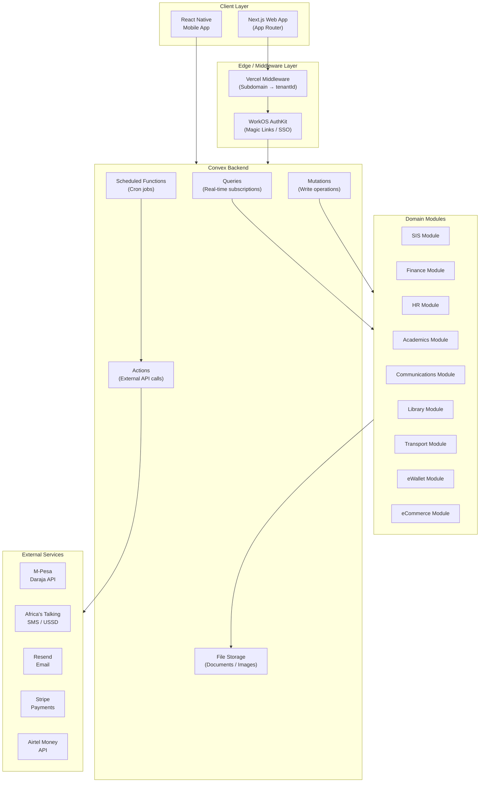

# 0. Agent Action Plan

## 0.1 Product Understanding

### 0.1.1 Core Product Vision

Based on the prompt, the Blitzy platform understands that the new product is **EduMyles** — a production-grade, multi-tenant, modular school management SaaS platform purpose-built for the East African education market, with Kenya as the primary launch market. The platform aims to digitize and streamline all aspects of school administration, from student enrollment and academic tracking to financial management, HR/payroll, and parent communication — all delivered through a real-time, serverless architecture optimized for low-bandwidth environments and mobile-money-first economies.

**Functional Requirements:**

- **Multi-Tenant School Management:** Each school operates as an isolated tenant (TENANT-{6-digit-code}) with its own subdomain (school.edumyles.com), data, modules, and configuration. Schema-per-tenant isolation is enforced at every Convex query via mandatory `tenantId` filtering.
- **12 Core Modules:** Student Information System (SIS), Admissions & Enrollment, Fee & Finance Management, Timetable & Scheduling, Academics & Gradebook, HR & Payroll, Library Management, Transport Management, Parent & Student Portal, Communication & Notifications, eWallet, and eCommerce. Modules are installable/uninstallable per tenant from a marketplace.
- **12 User Roles:** Master Admin, Super Admin, School Admin, Principal/Head Teacher, Teacher, Parent/Guardian, Student, Bursar/Finance Officer, HR Manager, Librarian, Transport/Driver Manager, and Board Member — each with role-based access and module-level permissions.
- **Authentication & Sessions:** WorkOS-powered magic link authentication (64-char token, 15-min expiry, max 3 attempts, 5-min cooldown), SSO for enterprise tenants, session management in Convex (30-day expiry, device info tracking).
- **Payment Processing:** M-Pesa STK Push (Daraja API), Airtel Money, Stripe, Visa/Mastercard, and Bank Transfer support. eWallet funds route directly to school's M-Pesa/bank account — EduMyles does not hold float.
- **Communication Engine:** SMS via Africa's Talking, Email via Resend for fee reminders, exam results, attendance alerts, payroll slips, transport notifications, and system announcements.
- **Offline Capabilities:** Tiered offline strategy — full offline sync for Attendance and Gradebook; read-only offline for SIS, HR, and Timetable; online-only for eWallet, eCommerce, Finance, and Payroll.
- **Multi-Curriculum Support:** Kenya CBC, 8-4-4, IGCSE/Cambridge, University GPA, TVET/Vocational, and ACE grading systems.
- **Student Lifecycle Management:** Complete lifecycle from admission through enrollment, grade promotion, graduation, and alumni tracking with automated workflows for each transition.
- **Report Card Generation:** PDF report cards with school letterhead, student photo, QR codes for verification, supporting batch processing and distribution via email/SMS/portal.
- **Emergency Alert System:** Real-time broadcast to all users with acknowledgment tracking, status updates, and incident reporting.

**Non-Functional Requirements:**

- **Performance:** Real-time updates via Convex subscriptions; optimized for low-bandwidth East African environments; PWA support for mobile-friendly portals.
- **Scalability:** Year 1 target of 50–100 schools and up to 50,000 students; Year 3 target of 500 schools and 300,000 students.
- **Security:** Strict tenant data isolation (no cross-tenant data leakage), 7-year audit log retention, Master Admin impersonation with audit logging and warning banner, encrypted sessions, RBAC enforcement at every query level.
- **Compliance:** Kenya NEMIS data export (CSV/Excel in v1, live API sync in v2), KNEC data export, PAYE/NSSF/SHIF payroll calculations, KEMIS export capability.
- **Availability:** Serverless architecture via Convex Cloud and Vercel for high availability; automatic platform updates without downtime.
- **Monetization:** Per-student/month subscription model with Free, Starter, Pro, Premium, Ultra, and Enterprise tiers. Billing cycles: Monthly, Termly (3 months), and Yearly with volume discounts.

**Implicit Requirements Surfaced:**

- Tenant provisioning and onboarding workflow including data import automation (KES 30,000 fee covers migration)
- SMS quota management per subscription tier (0 for Free, 1,000/mo for Starter, 5,000/mo for Pro, unlimited for Premium+)
- Storage quota enforcement per plan (1 GB Free to 500 GB Ultra)
- Module marketplace with tier-based access control and dependency management
- Webhook endpoints for M-Pesa callbacks, Africa's Talking delivery reports, and WorkOS authentication callbacks
- PDF generation service for report cards, receipts, transcripts, diplomas, and payroll slips
- Bulk CSV import/export for students, staff, and data migration
- Rate limiting infrastructure for magic link generation, SMS sending, and API endpoints

### 0.1.2 User Instructions Interpretation

**Technology Stack Directives (preserved exactly as specified):**

- User Example: `"Frontend: Next.js (App Router)"`
- User Example: `"Backend/Database: Convex (real-time, serverless)"`
- User Example: `"Authentication: WorkOS (magic links, SSO, Organizations)"`
- User Example: `"SMS: Africa's Talking"`
- User Example: `"Email: Resend"`
- User Example: `"Hosting: Vercel (subdomain routing via middleware)"`
- User Example: `"Mobile: React Native (iOS & Android)"`
- User Example: `"Payments: M-Pesa (Daraja API), Airtel Money, Stripe, Card, Bank Transfer"`

**Architecture Pattern Directives:**

- User Example: `"Multi-tenancy: Schema-per-tenant with mandatory tenantId on EVERY Convex query"`
- User Example: `"Tenant ID format: TENANT-{6-digit-code} e.g. TENANT-145629"`
- User Example: `"User ID format: {TENANT-CODE}-{USER-TYPE}-{SEQUENTIAL} e.g. TENANT-145629-STU-000001"`
- User Example: `"Subdomains: school.edumyles.com via Vercel middleware (Phase 1)"`
- User Example: `"Custom domains: school.com for Enterprise tier (Phase 2)"`
- User Example: `"Sessions: WorkOS handles authentication, Convex stores app session (tenantId, role, permissions, device info, 30-day expiry)"`

**Offline Strategy Directives:**

- User Example: `"Full offline (sync on reconnect): Attendance, Gradebook"`
- User Example: `"Read-only offline: SIS, HR records, Timetable viewing"`
- User Example: `"Online only: eWallet, eCommerce, Finance, Payroll"`
- User Example: `"Sync strategy: Auto-sync on connectivity restore, last-write-wins"`

**Code Quality Directives:**

- User Example: `"All code must be production-grade: typed, error-handled, secure, scalable"`
- User Example: `"Always enforce tenantId isolation in every Convex query you write"`
- User Example: `"Follow Next.js App Router conventions (server components, server actions)"`
- User Example: `"Use Convex best practices: indexes, validators, proper error handling"`
- User Example: `"Flag any architectural risks or security concerns proactively"`
- User Example: `"When suggesting features or flows, consider the East African context (M-Pesa first, low-bandwidth environments, multilingual potential)"`

**Integration Requirements:**

- Kenya NEMIS: CSV/Excel export in v1, live API sync in v2
- KNEC: CSV/Excel export in v1, live API sync in v2
- Africa's Talking: SMS + USSD
- M-Pesa Daraja API: STK Push, C2B, B2C
- WorkOS: Auth, Organizations, SSO, Directory Sync

**Deployment Specifications:**

- Vercel for Next.js frontend hosting with subdomain routing via middleware
- Convex Cloud for serverless backend, database, and file storage
- React Native for iOS and Android mobile applications

### 0.1.3 Product Type Classification

- **Product Category:** Multi-tenant SaaS Web Application + Mobile Application + API Service
- **Target Users:** School administrators, principals, teachers, parents/guardians, students, bursars, HR managers, librarians, transport managers, and board members across East African educational institutions
- **Primary Use Cases:** School administration digitization, academic records management, fee collection and financial tracking, parent-school communication, staff management, and student lifecycle management
- **Scale Expectation:** Production-ready from day one — designed to scale from 50 schools to 500+ schools within 3 years, handling up to 300,000 concurrent student records
- **Maintenance & Evolution:** Platform must support zero-downtime updates, modular feature deployment via marketplace, tier-based feature gating, and backward-compatible API evolution. The pricing guide confirms 6 tiers (Free through Enterprise) with progressive feature unlocking.


## 0.2 Background Research

## 0.2 Background Research

### 0.2.1 Technology Research

Web search research conducted includes:

**Convex Backend Platform:**
- <cite index="11-1,11-2">The Convex npm client package (latest version 1.32.0) provides the TypeScript backend SDK, client libraries, and CLI.</cite> <cite index="5-1,5-2">Convex enables developers to express every part of their backend in pure TypeScript — from database schemas to queries, from auth to APIs.</cite> <cite index="5-7,5-8">Convex libraries guarantee that the app always reflects changes to frontend code, backend code, and database state in real time, with no need for state managers, cache invalidation policies, or websockets.</cite>
- <cite index="58-1">The `@convex-dev/resend` component is the official way to integrate the Resend email service with Convex projects.</cite> <cite index="58-2,58-3">It provides idempotency management for Resend keys to guarantee emails are delivered exactly once, and honors API rate limits established by Resend.</cite>

**Next.js Framework:**
- <cite index="22-1">Next.js 16.1 was released on December 18th, 2025, focusing on strengthening performance, stability, and developer confidence.</cite> <cite index="15-8,15-9">Next.js 16 features Turbopack as the default bundler, and the App Router uses the latest React Canary release including React 19.2 features.</cite>
- <cite index="14-1">The App Router is a file-system based router that uses React's latest features such as Server Components, Suspense, Server Functions, and more.</cite>
- For the EduMyles project, Next.js 15.x (stable LTS) is recommended over 16.x to ensure maximum ecosystem compatibility with Convex and WorkOS SDKs, with upgrade path to 16.x once all dependencies stabilize.

**WorkOS Authentication:**
- <cite index="27-18">WorkOS's authkit-nextjs library is designed specifically for Next.js App Router with native support for Server Components integration, edge runtime compatibility, and automatic session management.</cite>
- <cite index="27-11">WorkOS offers free authentication for up to 1 million monthly active users</cite>, making it highly cost-effective for the scale targets of EduMyles (300,000 students by Year 3 plus parents/staff).
- <cite index="24-10">The authkit-nextjs library is intended for use with the Next.js App Router.</cite> <cite index="24-18,24-19,24-20">The library relies on Next.js proxy (called middleware in Next.js ≤15) to provide session management. For Next.js 16+, a proxy.ts file is created; for Next.js ≤15, a middleware.ts file is used.</cite>

**M-Pesa Daraja API:**
- <cite index="35-2">Daraja 3.0 is a web platform that offers access to Safaricom and M-PESA APIs that creates a bridge for payment integration to web and mobile apps.</cite>
- <cite index="33-1,33-2">The C2B API enables Paybill and Buy Goods merchants to integrate to M-Pesa and receive real time payments notifications. The C2B Register URL API registers the 3rd party's confirmation and validation URLs to M-Pesa.</cite>
- <cite index="38-14">M-Pesa Express Request (Lipa Na M-Pesa Online Payment API) initiates a payment transaction using STK Push.</cite>

**Africa's Talking SMS:**
- <cite index="52-5">The `africastalking` npm package provides convenient access to the Africa's Talking API from applications written for Node.js.</cite>
- <cite index="50-4">With simplified access to telco infrastructure, developers use Africa's Talking's powerful SMS, USSD, Voice, Airtime and Mobile Data APIs to bring their ideas to life.</cite>

**Resend Email:**
- <cite index="53-2">The `resend` npm package (latest version 6.9.2) provides the Node.js library for the Resend API.</cite> Resend supports React Email templates for building rich HTML emails with JSX components, which integrates seamlessly with the Next.js/React ecosystem.

### 0.2.2 Architecture Pattern Research

**Multi-Tenant Architecture for Convex:**
- <cite index="66-11,66-12">Regardless of the chosen architecture, always prioritize data isolation. Even in shared environments, implement robust filtering mechanisms that enforce tenant boundaries at every level — application logic, database queries, and network access.</cite>
- <cite index="67-12,67-13">The application should enforce proper access controls to ensure that tenants can only read and write their own data. The best and easiest way to do this is to handle tenancy at the highest level and scope the entire application by tenant, disallowing any cross-tenant reads or writes.</cite>
- <cite index="65-1,65-2,65-3">A multi-tenant CRM built on Convex demonstrated that companies sign up, add their team, and manage contacts with technical requirements including permissions, real-time sync, mobile, API access, and background jobs.</cite>
- <cite index="65-11,65-12,65-13,65-14">Permission checks at the top of Convex queries work naturally because Convex queries are subscriptions, not one-off requests. They keep running, and every time the underlying data changes, the query re-evaluates.</cite> This pattern directly applies to EduMyles's mandatory `tenantId` filtering approach.

**Convex Real-Time Scalability:**
- <cite index="63-3,63-4">Convex's Funrun service enables pro customers to run 10 times as many functions concurrently. As its own multi-tenant service, Funrun can easily scale horizontally by increasing instances as applications scale.</cite>
- <cite index="68-1,68-2,68-3,68-4,68-5">All Convex functions are deterministic, making it easy to cache a query's output automatically. If the same query is called again with the same inputs, data returns faster from cache.</cite>

**Reference SaaS Architecture Pattern:**
- <cite index="64-1,64-2,64-3">The Iris SaaS Kit demonstrates built-in multi-tenant architecture with support for multiple tenants, super-admin tools, and instant typesafe updates powered by Convex.</cite> <cite index="64-11,64-12">It features email templates powered by React-Email and Resend, ready to plug and play.</cite>

### 0.2.3 Dependency and Tool Research

| Technology | Package | Version | Purpose |
|-----------|---------|---------|---------|
| Next.js | `next` | 15.x (stable) | Frontend framework with App Router |
| React | `react` / `react-dom` | 19.x | UI component library |
| Convex | `convex` | 1.32.0 | Real-time serverless backend |
| WorkOS | `@workos-inc/authkit-nextjs` | 2.12.x | Authentication SDK |
| Africa's Talking | `africastalking` | latest | SMS/USSD integration |
| Resend | `resend` | 6.9.2 | Email delivery service |
| Convex-Resend | `@convex-dev/resend` | 0.2.3 | Official Convex-Resend component |
| React Native | `react-native` | 0.76.x | Mobile app framework |
| Stripe | `stripe` / `@stripe/stripe-js` | latest | International payment processing |
| TypeScript | `typescript` | 5.x | Type safety across the stack |
| Tailwind CSS | `tailwindcss` | 4.x | Utility-first CSS framework |
| shadcn/ui | `@shadcn/ui` components | latest | Accessible component library |
| React Email | `@react-email/components` | latest | Email template components |
| Zod | `zod` | latest | Runtime schema validation |
| Vitest | `vitest` | latest | Unit testing framework |
| Playwright | `@playwright/test` | latest | E2E testing framework |

**Testing Framework:** Vitest for unit tests (fast, TypeScript-native), Playwright for end-to-end browser testing, and Convex's built-in testing utilities for backend function testing.

**CI/CD Pipeline:** GitHub Actions for automated testing, linting, and deployment to Vercel (frontend) and Convex Cloud (backend). Branch-based preview deployments via Vercel.


## 0.3 Technical Architecture Design

## 0.3 Technical Architecture Design

### 0.3.1 Technology Stack Selection

**Primary Language:** TypeScript 5.x
- Rationale: Enforces type safety across the entire stack (frontend, backend, mobile), prevents runtime type errors at the Convex query level, and enables shared type definitions between client and server — critical for enforcing `tenantId` isolation contracts at compile time.

**Frontend Framework:** Next.js 15.x (App Router)
- Rationale: The App Router provides Server Components for reduced client-side JavaScript (critical for low-bandwidth East African environments), Server Actions for secure form handling, and built-in middleware for subdomain-based tenant routing. Version 15.x is selected over 16.x for maximum stability with the Convex and WorkOS SDK ecosystems.

**Backend/Database:** Convex 1.32.0
- Rationale: Convex provides a unified serverless backend combining real-time database, file storage, scheduled functions, and serverless compute in a single platform. Its reactive query subscriptions eliminate the need for WebSocket management, and its built-in validator system enforces schema integrity at the function boundary — directly supporting the mandatory `tenantId` filtering pattern.

**Authentication:** WorkOS (via `@workos-inc/authkit-nextjs`)
- Rationale: WorkOS provides enterprise-grade authentication with magic links, SSO, Organizations, and Directory Sync — all required by EduMyles. Free for up to 1M MAU, which covers EduMyles's Year 3 scale target. The Organizations feature maps directly to EduMyles's multi-tenant model.

**Email Service:** Resend 6.9.2 + `@convex-dev/resend` 0.2.3
- Rationale: Official Convex integration guarantees exactly-once email delivery via idempotency management. React Email templates enable JSX-based email authoring that shares components with the Next.js frontend.

**SMS/USSD Service:** Africa's Talking (Node.js SDK)
- Rationale: Africa's Talking is the de facto standard for SMS delivery in East Africa, with direct telco integrations for Kenya, Uganda, Tanzania, and Rwanda. USSD support enables feature phone access for parents in areas without smartphones.

**Payment Processing:**
- M-Pesa Daraja API 3.0 — Primary payment method for the East African market; supports STK Push (Lipa Na M-Pesa), C2B (Paybill), and B2C (disbursements)
- Airtel Money API — Secondary mobile money provider for East Africa
- Stripe + `@stripe/stripe-js` — International card payments (Visa/Mastercard) and bank transfers for diaspora parents and enterprise clients

**Mobile Framework:** React Native 0.76.x
- Rationale: Code sharing with the Next.js web app via shared TypeScript types and Convex client. React Native supports both iOS and Android from a single codebase, reducing development cost for the mobile companion app.

**CSS Framework:** Tailwind CSS 4.x + shadcn/ui
- Rationale: Tailwind provides utility-first styling with minimal CSS bundle size (important for low-bandwidth), and shadcn/ui offers accessible, customizable components that integrate with Tailwind natively.

**Hosting:**
- Vercel — Next.js frontend hosting with global CDN, edge middleware for subdomain routing, and preview deployments
- Convex Cloud — Serverless backend hosting with automatic scaling, zero-ops database management, and built-in file storage

### 0.3.2 Architecture Pattern

**Overall Pattern:** Multi-Tenant Serverless Monolith with Modular Domain Separation

The architecture follows a serverless monolith pattern where all backend logic resides in a single Convex deployment, organized into domain-specific modules. This is the recommended pattern for Convex applications and provides the real-time subscription benefits that underpin EduMyles's collaborative features (live attendance, real-time grade updates, instant payment notifications).

**Justification:**
- Convex functions are inherently serverless and scale horizontally without manual infrastructure management
- A single deployment simplifies tenant isolation enforcement (one `tenantId` guard layer)
- Domain modules (SIS, Finance, HR, etc.) are logically separated but share the same database for cross-module queries (e.g., fee calculations referencing student enrollment data)
- The module marketplace pattern enables feature gating at the application layer without requiring separate deployments

**Component Interaction Model:**



**Data Flow Architecture:**

- **Read Path:** Client subscribes to Convex query → Query validates session and extracts `tenantId` → Query filters all data by `tenantId` → Real-time results pushed to client via WebSocket
- **Write Path:** Client invokes Convex mutation → Mutation validates session, `tenantId`, and RBAC permissions → Mutation writes data with `tenantId` attached → All subscribed queries automatically re-evaluate
- **External Action Path:** Convex action triggered (by mutation, scheduler, or HTTP endpoint) → Action calls external API (M-Pesa, Africa's Talking, Resend) → Result stored back via internal mutation
- **Webhook Path:** External service posts to Convex HTTP endpoint → HTTP action validates webhook signature → Internal mutation processes and stores the event

**Security Architecture:**

- **Tenant Isolation:** Every Convex query, mutation, and action begins with `tenantId` extraction from the authenticated session. No function operates without a valid `tenantId` context. Database indexes are structured with `tenantId` as the leading key to enforce partition-level isolation.
- **Authentication Layer:** WorkOS handles all credential management (magic links, SSO tokens). Convex stores the application session containing `tenantId`, `userId`, `role`, `permissions[]`, and `deviceInfo`. Session expiry is 30 days.
- **Authorization Layer:** Role-Based Access Control (RBAC) is enforced at the Convex function boundary. Each function declares its required role(s) and permission(s). A centralized `authorize()` helper validates the session against the required permissions before executing any business logic.
- **Audit Trail:** All write operations log the actor (`userId`), action, timestamp, `tenantId`, and before/after state. Master Admin impersonation events are logged to a separate audit table with elevated retention.
- **Data Encryption:** All data in transit uses TLS 1.3 (enforced by Convex Cloud and Vercel). Sensitive fields (payment tokens, session keys) are encrypted at rest within Convex.

### 0.3.3 Integration Points

**WorkOS Authentication Integration:**
- **Protocol:** OAuth 2.0 / OpenID Connect via AuthKit middleware
- **Data Exchange:** JSON (JWT tokens for session validation)
- **Integration Pattern:** Next.js middleware intercepts requests → Validates session via WorkOS → Extracts `organizationId` → Maps to EduMyles `tenantId` → Injects session context into Convex client
- **Callbacks:** `/api/auth/callback` for OAuth redirect, `/api/auth/sign-out` for session termination

**M-Pesa Daraja API Integration:**
- **Protocol:** HTTPS REST API with OAuth 2.0 bearer tokens
- **Data Exchange:** JSON request/response payloads
- **Endpoints Used:**
  - STK Push (`/mpesa/stkpush/v1/processrequest`) — Initiate payment from student/parent
  - C2B Register URL (`/mpesa/c2b/v1/registerurl`) — Register school Paybill confirmation endpoints
  - B2C (`/mpesa/b2c/v1/paymentrequest`) — Salary disbursements (future phase)
- **Webhook Callbacks:** Convex HTTP actions registered as confirmation/validation URLs for real-time payment status updates
- **Auth:** Consumer key/secret per-tenant (school registers their own Daraja app) or EduMyles platform-level credentials with sub-account routing

**Africa's Talking Integration:**
- **Protocol:** HTTPS REST API
- **Data Exchange:** JSON/form-encoded payloads
- **Services Used:** Bulk SMS for notifications, USSD for feature-phone access
- **Callbacks:** Delivery reports posted to Convex HTTP action endpoints for message status tracking
- **Quota Management:** SMS credits tracked per-tenant per-plan tier; throttled at the application layer

**Resend Email Integration:**
- **Protocol:** HTTPS REST API via `@convex-dev/resend` Convex component
- **Data Exchange:** JSON payloads with React Email HTML templates
- **Features:** Idempotent sends, rate limit compliance, batch sending for bulk notifications (report cards, fee reminders)
- **Templates:** React Email components for each notification type (fee receipt, exam results, attendance alert, payroll slip)

**Stripe Integration:**
- **Protocol:** HTTPS REST API + Stripe.js client SDK
- **Data Exchange:** JSON with webhook events
- **Endpoints Used:** Payment Intents for card payments, Checkout Sessions for hosted payment pages, Webhooks for async payment status updates
- **Auth:** Per-tenant Stripe Connect accounts or platform-level with transfer routing

**Kenya NEMIS / KNEC Integration (v1):**
- **Protocol:** CSV/Excel file export (no live API in v1)
- **Data Exchange:** Structured CSV files conforming to NEMIS/KNEC data submission formats
- **Integration Pattern:** Convex action generates export file → Stored in Convex File Storage → Downloaded by School Admin from the portal
- **v2 Upgrade Path:** Live API sync via scheduled Convex actions with webhook-based status tracking


## 0.4 Repository Structure Planning

## 0.4 Repository Structure Planning

### 0.4.1 Proposed Repository Structure

The repository follows a monorepo structure with clear separation between the Next.js web application, Convex backend, React Native mobile app, and shared packages. Domain modules are organized by bounded context, and each module contains its own queries, mutations, actions, and schema definitions.

```
/
├── src/                                    # Next.js web application source
│   ├── app/                                # App Router pages and layouts
│   │   ├── (auth)/                         # Authentication route group
│   │   │   ├── sign-in/
│   │   │   │   └── page.tsx                # Magic link sign-in page
│   │   │   ├── callback/
│   │   │   │   └── page.tsx                # WorkOS OAuth callback handler
│   │   │   └── layout.tsx                  # Auth layout (no sidebar)
│   │   ├── (platform)/                     # Platform admin route group (Master/Super Admin)
│   │   │   ├── dashboard/
│   │   │   │   └── page.tsx                # Platform-wide analytics dashboard
│   │   │   ├── tenants/
│   │   │   │   ├── page.tsx                # Tenant management list
│   │   │   │   └── [tenantId]/
│   │   │   │       └── page.tsx            # Individual tenant detail/config
│   │   │   ├── billing/
│   │   │   │   └── page.tsx                # Subscription and billing management
│   │   │   ├── marketplace/
│   │   │   │   └── page.tsx                # Module marketplace administration
│   │   │   └── layout.tsx                  # Platform admin layout with nav
│   │   ├── (tenant)/                       # Tenant-scoped route group
│   │   │   ├── dashboard/
│   │   │   │   └── page.tsx                # School-level dashboard
│   │   │   ├── sis/                        # Student Information System
│   │   │   │   ├── students/
│   │   │   │   │   ├── page.tsx            # Student list with search/filter
│   │   │   │   │   ├── new/
│   │   │   │   │   │   └── page.tsx        # Add new student form
│   │   │   │   │   └── [studentId]/
│   │   │   │   │       ├── page.tsx        # Student profile detail
│   │   │   │   │       └── edit/
│   │   │   │   │           └── page.tsx    # Edit student information
│   │   │   │   └── reports/
│   │   │   │       └── page.tsx            # SIS reports and exports
│   │   │   ├── admissions/                 # Admissions & Enrollment
│   │   │   │   ├── applications/
│   │   │   │   │   ├── page.tsx            # Application list and pipeline
│   │   │   │   │   └── [applicationId]/
│   │   │   │   │       └── page.tsx        # Application review detail
│   │   │   │   ├── enrollment/
│   │   │   │   │   └── page.tsx            # Enrollment processing
│   │   │   │   └── settings/
│   │   │   │       └── page.tsx            # Admission period configuration
│   │   │   ├── finance/                    # Fee & Finance Management
│   │   │   │   ├── fees/
│   │   │   │   │   ├── page.tsx            # Fee structure management
│   │   │   │   │   └── [feeId]/
│   │   │   │   │       └── page.tsx        # Fee detail and payment history
│   │   │   │   ├── payments/
│   │   │   │   │   └── page.tsx            # Payment records and reconciliation
│   │   │   │   ├── invoices/
│   │   │   │   │   └── page.tsx            # Invoice generation and tracking
│   │   │   │   └── reports/
│   │   │   │       └── page.tsx            # Financial reports and dashboards
│   │   │   ├── timetable/                  # Timetable & Scheduling
│   │   │   │   ├── page.tsx                # Timetable grid view
│   │   │   │   ├── builder/
│   │   │   │   │   └── page.tsx            # Drag-and-drop timetable builder
│   │   │   │   └── classes/
│   │   │   │       └── page.tsx            # Class and room management
│   │   │   ├── academics/                  # Academics & Gradebook
│   │   │   │   ├── gradebook/
│   │   │   │   │   ├── page.tsx            # Grade entry and overview
│   │   │   │   │   └── [classId]/
│   │   │   │   │       └── page.tsx        # Per-class gradebook
│   │   │   │   ├── report-cards/
│   │   │   │   │   └── page.tsx            # Report card generation
│   │   │   │   ├── assignments/
│   │   │   │   │   └── page.tsx            # Assignment management
│   │   │   │   └── curriculum/
│   │   │   │       └── page.tsx            # Curriculum configuration (CBC, 8-4-4, etc.)
│   │   │   ├── hr/                         # HR & Payroll
│   │   │   │   ├── staff/
│   │   │   │   │   ├── page.tsx            # Staff directory
│   │   │   │   │   └── [staffId]/
│   │   │   │   │       └── page.tsx        # Staff profile detail
│   │   │   │   ├── payroll/
│   │   │   │   │   ├── page.tsx            # Payroll dashboard
│   │   │   │   │   └── [periodId]/
│   │   │   │   │       └── page.tsx        # Payroll period detail
│   │   │   │   └── leave/
│   │   │   │       └── page.tsx            # Leave management
│   │   │   ├── library/                    # Library Management
│   │   │   │   ├── catalog/
│   │   │   │   │   └── page.tsx            # Book catalog and search
│   │   │   │   ├── circulation/
│   │   │   │   │   └── page.tsx            # Check-in/check-out tracking
│   │   │   │   └── fines/
│   │   │   │       └── page.tsx            # Fine management
│   │   │   ├── transport/                  # Transport Management
│   │   │   │   ├── routes/
│   │   │   │   │   └── page.tsx            # Route management
│   │   │   │   ├── vehicles/
│   │   │   │   │   └── page.tsx            # Vehicle fleet management
│   │   │   │   └── tracking/
│   │   │   │       └── page.tsx            # Live tracking dashboard
│   │   │   ├── portal/                     # Parent & Student Portal
│   │   │   │   ├── page.tsx                # Portal home (role-based)
│   │   │   │   ├── children/
│   │   │   │   │   └── [childId]/
│   │   │   │   │       └── page.tsx        # Child academic overview (parent)
│   │   │   │   └── my-grades/
│   │   │   │       └── page.tsx            # Student grade viewer
│   │   │   ├── communications/             # Communication & Notifications
│   │   │   │   ├── announcements/
│   │   │   │   │   └── page.tsx            # School announcements
│   │   │   │   ├── messages/
│   │   │   │   │   └── page.tsx            # Direct messaging
│   │   │   │   └── templates/
│   │   │   │       └── page.tsx            # Notification template management
│   │   │   ├── wallet/                     # eWallet
│   │   │   │   ├── page.tsx                # Wallet dashboard and balance
│   │   │   │   ├── topup/
│   │   │   │   │   └── page.tsx            # Top-up via M-Pesa/card
│   │   │   │   └── transactions/
│   │   │   │       └── page.tsx            # Transaction history
│   │   │   ├── shop/                       # eCommerce
│   │   │   │   ├── page.tsx                # School shop storefront
│   │   │   │   ├── [productId]/
│   │   │   │   │   └── page.tsx            # Product detail page
│   │   │   │   ├── cart/
│   │   │   │   │   └── page.tsx            # Shopping cart
│   │   │   │   └── orders/
│   │   │   │       └── page.tsx            # Order history
│   │   │   ├── settings/                   # Tenant settings
│   │   │   │   ├── general/
│   │   │   │   │   └── page.tsx            # School profile and branding
│   │   │   │   ├── roles/
│   │   │   │   │   └── page.tsx            # Role and permission management
│   │   │   │   ├── modules/
│   │   │   │   │   └── page.tsx            # Module installation/config
│   │   │   │   └── integrations/
│   │   │   │       └── page.tsx            # Third-party integration settings
│   │   │   └── layout.tsx                  # Tenant layout with sidebar, header, breadcrumbs
│   │   ├── api/                            # API route handlers
│   │   │   ├── auth/
│   │   │   │   └── callback/
│   │   │   │       └── route.ts            # WorkOS auth callback handler
│   │   │   ├── webhooks/
│   │   │   │   ├── mpesa/
│   │   │   │   │   └── route.ts            # M-Pesa payment callback
│   │   │   │   ├── stripe/
│   │   │   │   │   └── route.ts            # Stripe webhook handler
│   │   │   │   └── africastalking/
│   │   │   │       └── route.ts            # SMS delivery report callback
│   │   │   └── exports/
│   │   │       └── [type]/
│   │   │           └── route.ts            # NEMIS/KNEC data export handler
│   │   ├── globals.css                     # Global styles and Tailwind imports
│   │   ├── layout.tsx                      # Root layout with providers
│   │   └── not-found.tsx                   # Custom 404 page
│   ├── components/                         # Shared UI components
│   │   ├── ui/                             # shadcn/ui base components
│   │   │   ├── button.tsx
│   │   │   ├── input.tsx
│   │   │   ├── dialog.tsx
│   │   │   ├── data-table.tsx
│   │   │   ├── select.tsx
│   │   │   ├── card.tsx
│   │   │   └── ...                         # Additional shadcn/ui components
│   │   ├── layout/                         # Layout components
│   │   │   ├── sidebar.tsx                 # Tenant sidebar navigation
│   │   │   ├── header.tsx                  # Top header with user menu
│   │   │   ├── breadcrumbs.tsx             # Dynamic breadcrumb navigation
│   │   │   └── mobile-nav.tsx              # Mobile responsive navigation
│   │   ├── forms/                          # Shared form components
│   │   │   ├── student-form.tsx            # Student creation/edit form
│   │   │   ├── staff-form.tsx              # Staff creation/edit form
│   │   │   ├── fee-form.tsx                # Fee structure form
│   │   │   └── payment-form.tsx            # Payment processing form
│   │   ├── tables/                         # Data table configurations
│   │   │   ├── student-columns.tsx         # Student table column defs
│   │   │   ├── staff-columns.tsx           # Staff table column defs
│   │   │   └── payment-columns.tsx         # Payment table column defs
│   │   ├── charts/                         # Dashboard chart components
│   │   │   ├── enrollment-chart.tsx        # Enrollment trends
│   │   │   ├── revenue-chart.tsx           # Revenue analytics
│   │   │   └── attendance-chart.tsx        # Attendance statistics
│   │   └── shared/                         # Cross-module shared components
│   │       ├── tenant-guard.tsx            # Tenant context validation wrapper
│   │       ├── role-guard.tsx              # RBAC permission wrapper
│   │       ├── offline-indicator.tsx       # Connectivity status indicator
│   │       ├── impersonation-banner.tsx    # Master Admin impersonation warning
│   │       ├── pdf-viewer.tsx              # PDF document viewer
│   │       └── file-uploader.tsx           # File upload with Convex storage
│   ├── hooks/                              # Custom React hooks
│   │   ├── use-tenant.ts                   # Current tenant context hook
│   │   ├── use-auth.ts                     # Authentication state hook
│   │   ├── use-permissions.ts              # Permission checking hook
│   │   ├── use-offline.ts                  # Offline status detection hook
│   │   ├── use-wallet.ts                   # eWallet balance and operations
│   │   └── use-notifications.ts            # Real-time notification hook
│   ├── lib/                                # Utility libraries
│   │   ├── utils.ts                        # General utility functions
│   │   ├── constants.ts                    # Application constants (roles, tiers, etc.)
│   │   ├── formatting.ts                   # Currency (KES), date, phone formatters
│   │   ├── validators.ts                   # Client-side validation schemas (Zod)
│   │   ├── tenant-utils.ts                 # Tenant ID parsing and validation
│   │   └── curriculum.ts                   # Curriculum-specific grading utilities
│   ├── providers/                          # React context providers
│   │   ├── convex-provider.tsx             # Convex client provider
│   │   ├── auth-provider.tsx               # WorkOS auth context provider
│   │   ├── tenant-provider.tsx             # Tenant context provider
│   │   ├── theme-provider.tsx              # Theme (light/dark) provider
│   │   └── offline-provider.tsx            # Offline state management provider
│   └── styles/                             # Additional style files
│       └── email-templates.css             # Email template styles
├── convex/                                 # Convex backend (serverless functions + schema)
│   ├── _generated/                         # Auto-generated by Convex CLI
│   │   ├── api.d.ts                        # Type-safe API definitions
│   │   ├── dataModel.d.ts                  # Database model types
│   │   └── server.d.ts                     # Server function types
│   ├── schema.ts                           # Master database schema definition
│   ├── auth.ts                             # Authentication helpers and session management
│   ├── helpers/                            # Shared backend helpers
│   │   ├── tenantGuard.ts                  # tenantId extraction and validation
│   │   ├── authorize.ts                    # RBAC permission enforcement
│   │   ├── auditLog.ts                     # Audit trail logging utility
│   │   ├── idGenerator.ts                  # Custom ID generation (TENANT-XXX-TYPE-NNNNNN)
│   │   ├── validators.ts                   # Shared Convex validators (v.object patterns)
│   │   └── pagination.ts                   # Cursor-based pagination helper
│   ├── modules/                            # Domain module functions
│   │   ├── sis/                            # Student Information System
│   │   │   ├── queries.ts                  # Student queries (list, get, search)
│   │   │   ├── mutations.ts                # Student CRUD mutations
│   │   │   ├── actions.ts                  # External actions (NEMIS export)
│   │   │   └── validators.ts               # SIS-specific input validators
│   │   ├── admissions/                     # Admissions & Enrollment
│   │   │   ├── queries.ts                  # Application queries
│   │   │   ├── mutations.ts                # Application processing mutations
│   │   │   └── validators.ts               # Admission validators
│   │   ├── finance/                        # Fee & Finance Management
│   │   │   ├── queries.ts                  # Fee, invoice, payment queries
│   │   │   ├── mutations.ts                # Fee assignment, payment recording
│   │   │   ├── actions.ts                  # M-Pesa STK Push, Stripe intents
│   │   │   └── validators.ts               # Finance validators
│   │   ├── timetable/                      # Timetable & Scheduling
│   │   │   ├── queries.ts                  # Schedule queries
│   │   │   ├── mutations.ts                # Timetable CRUD
│   │   │   └── validators.ts               # Timetable validators
│   │   ├── academics/                      # Academics & Gradebook
│   │   │   ├── queries.ts                  # Grade, assignment queries
│   │   │   ├── mutations.ts                # Grade entry, report card generation
│   │   │   ├── actions.ts                  # PDF report card generation
│   │   │   └── validators.ts               # Academic validators
│   │   ├── hr/                             # HR & Payroll
│   │   │   ├── queries.ts                  # Staff, payroll queries
│   │   │   ├── mutations.ts                # Staff CRUD, payroll processing
│   │   │   ├── actions.ts                  # Payroll calculation, PAYE/NSSF
│   │   │   └── validators.ts               # HR validators
│   │   ├── library/                        # Library Management
│   │   │   ├── queries.ts                  # Catalog, circulation queries
│   │   │   ├── mutations.ts                # Book CRUD, check-in/check-out
│   │   │   └── validators.ts               # Library validators
│   │   ├── transport/                      # Transport Management
│   │   │   ├── queries.ts                  # Route, vehicle queries
│   │   │   ├── mutations.ts                # Route CRUD, assignment
│   │   │   └── validators.ts               # Transport validators
│   │   ├── portal/                         # Parent & Student Portal
│   │   │   ├── queries.ts                  # Parent/student-specific queries
│   │   │   └── validators.ts               # Portal validators
│   │   ├── communications/                 # Communication & Notifications
│   │   │   ├── queries.ts                  # Message, announcement queries
│   │   │   ├── mutations.ts                # Send notification, create announcement
│   │   │   ├── actions.ts                  # SMS via Africa's Talking, Email via Resend
│   │   │   └── validators.ts               # Communication validators
│   │   ├── wallet/                         # eWallet
│   │   │   ├── queries.ts                  # Balance, transaction queries
│   │   │   ├── mutations.ts                # Top-up, spend, transfer mutations
│   │   │   ├── actions.ts                  # M-Pesa top-up action
│   │   │   └── validators.ts               # Wallet validators
│   │   └── ecommerce/                      # eCommerce
│   │       ├── queries.ts                  # Product, order queries
│   │       ├── mutations.ts                # Cart, order, inventory mutations
│   │       └── validators.ts               # eCommerce validators
│   ├── platform/                           # Platform-level functions (Master/Super Admin)
│   │   ├── tenants/
│   │   │   ├── queries.ts                  # Tenant listing, analytics
│   │   │   └── mutations.ts                # Tenant provisioning, suspension
│   │   ├── billing/
│   │   │   ├── queries.ts                  # Subscription, invoice queries
│   │   │   └── mutations.ts                # Plan changes, billing mutations
│   │   ├── marketplace/
│   │   │   ├── queries.ts                  # Module catalog queries
│   │   │   └── mutations.ts                # Module publish/unpublish
│   │   └── impersonation/
│   │       ├── mutations.ts                # Start/end impersonation session
│   │       └── queries.ts                  # Active impersonation status
│   ├── http.ts                             # HTTP endpoint definitions (webhooks)
│   └── crons.ts                            # Scheduled function definitions
├── mobile/                                 # React Native mobile application
│   ├── app/                                # Expo Router screens
│   │   ├── (auth)/
│   │   │   └── sign-in.tsx                 # Mobile sign-in screen
│   │   ├── (tabs)/
│   │   │   ├── dashboard.tsx               # Dashboard tab
│   │   │   ├── attendance.tsx              # Quick attendance tab
│   │   │   ├── grades.tsx                  # Grades tab
│   │   │   ├── wallet.tsx                  # Wallet tab
│   │   │   └── notifications.tsx           # Notifications tab
│   │   └── _layout.tsx                     # Root layout
│   ├── components/                         # Mobile-specific components
│   │   ├── AttendanceScanner.tsx            # QR/NFC attendance scanner
│   │   └── MPesaPayment.tsx                # M-Pesa payment flow component
│   ├── hooks/                              # Mobile-specific hooks
│   │   └── useOfflineSync.ts               # Offline data sync hook
│   ├── app.json                            # Expo configuration
│   ├── package.json                        # Mobile dependencies
│   └── tsconfig.json                       # Mobile TypeScript config
├── packages/                               # Shared packages (monorepo)
│   └── shared/                             # Shared types and utilities
│       ├── types/
│       │   ├── tenant.ts                   # Tenant-related type definitions
│       │   ├── user.ts                     # User and role type definitions
│       │   ├── modules.ts                  # Module type definitions
│       │   ├── curriculum.ts               # Curriculum type definitions
│       │   └── payments.ts                 # Payment type definitions
│       ├── constants/
│       │   ├── roles.ts                    # Role enums and permission maps
│       │   ├── tiers.ts                    # Subscription tier definitions
│       │   └── modules.ts                  # Module registry constants
│       └── validators/
│           ├── tenant.ts                   # Tenant ID format validators
│           └── user.ts                     # User ID format validators
├── emails/                                 # React Email templates
│   ├── fee-reminder.tsx                    # Fee payment reminder template
│   ├── exam-results.tsx                    # Exam results notification
│   ├── attendance-alert.tsx                # Attendance alert to parents
│   ├── payroll-slip.tsx                    # Payroll slip email
│   ├── welcome.tsx                         # New user welcome email
│   └── layout.tsx                          # Shared email layout component
├── tests/                                  # Test suite
│   ├── unit/                               # Unit tests
│   │   ├── convex/                         # Convex function tests
│   │   │   ├── sis.test.ts                 # SIS module tests
│   │   │   ├── finance.test.ts             # Finance module tests
│   │   │   ├── auth.test.ts                # Authentication tests
│   │   │   └── tenantGuard.test.ts         # Tenant isolation tests
│   │   └── components/                     # UI component tests
│   │       ├── student-form.test.tsx        # Student form tests
│   │       └── data-table.test.tsx          # Data table tests
│   ├── integration/                        # Integration tests
│   │   ├── mpesa-flow.test.ts              # M-Pesa payment flow tests
│   │   ├── enrollment-flow.test.ts         # Student enrollment flow tests
│   │   └── auth-flow.test.ts               # Authentication flow tests
│   ├── e2e/                                # End-to-end tests (Playwright)
│   │   ├── sign-in.spec.ts                 # Sign-in flow E2E
│   │   ├── student-management.spec.ts      # Student CRUD E2E
│   │   └── payment.spec.ts                 # Payment flow E2E
│   └── fixtures/                           # Test data and mocks
│       ├── tenants.ts                      # Mock tenant data
│       ├── students.ts                     # Mock student records
│       └── payments.ts                     # Mock payment records
├── docs/                                   # Project documentation
│   ├── architecture/                       # Architecture documentation
│   │   ├── system-overview.md              # High-level system architecture
│   │   ├── data-flow.md                    # Data flow documentation
│   │   └── tenant-isolation.md             # Multi-tenancy design doc
│   ├── api/                                # API documentation
│   │   ├── convex-functions.md             # Convex function reference
│   │   └── webhooks.md                     # Webhook endpoint documentation
│   ├── guides/                             # Developer and user guides
│   │   ├── getting-started.md              # Local development setup
│   │   ├── deployment.md                   # Deployment guide
│   │   ├── adding-modules.md               # How to add new modules
│   │   └── tenant-onboarding.md            # Tenant provisioning guide
│   └── compliance/                         # Compliance documentation
│       ├── nemis-export.md                 # NEMIS data export guide
│       └── data-privacy.md                 # Data privacy and security policy
├── scripts/                                # Utility scripts
│   ├── setup.sh                            # Development environment setup
│   ├── seed-dev.ts                         # Development data seeding
│   ├── seed-demo.ts                        # Demo tenant data seeding
│   └── migrate.ts                          # Data migration utilities
├── public/                                 # Static assets
│   ├── logo.svg                            # EduMyles logo
│   ├── favicon.ico                         # Favicon
│   └── manifest.json                       # PWA manifest
├── config/                                 # Environment configurations
│   ├── development/
│   │   └── .env.local                      # Local dev environment variables
│   ├── staging/
│   │   └── .env.staging                    # Staging environment variables
│   └── production/
│       └── .env.production                 # Production environment variables
├── .github/                                # GitHub configuration
│   ├── workflows/
│   │   ├── ci.yml                          # CI pipeline (lint, test, type-check)
│   │   ├── deploy-preview.yml              # Preview deployment on PR
│   │   └── deploy-production.yml           # Production deployment
│   ├── PULL_REQUEST_TEMPLATE.md            # PR template
│   └── CODEOWNERS                          # Code ownership rules
├── package.json                            # Root package.json (workspace)
├── pnpm-workspace.yaml                     # pnpm workspace configuration
├── tsconfig.json                           # Root TypeScript configuration
├── tailwind.config.ts                      # Tailwind CSS configuration
├── next.config.ts                          # Next.js configuration
├── components.json                         # shadcn/ui configuration
├── convex.json                             # Convex project configuration
├── vitest.config.ts                        # Vitest test configuration
├── playwright.config.ts                    # Playwright E2E configuration
├── Dockerfile                              # Container definition
├── docker-compose.yml                      # Local development orchestration
├── .eslintrc.json                          # ESLint configuration
├── .prettierrc                             # Prettier formatting rules
├── .gitignore                              # Git ignore rules
├── .env.example                            # Environment variables template
├── LICENSE                                 # License file
└── README.md                               # Project documentation
```

### 0.4.2 File Path Specifications

**Core Application Files:**
- `src/app/(tenant)/layout.tsx` — Tenant-scoped root layout; initializes tenant context from subdomain, renders sidebar navigation with role-based module filtering
- `src/app/(tenant)/dashboard/page.tsx` — Role-adaptive school dashboard; displays KPIs relevant to the authenticated user's role (enrollment counts for admins, class schedules for teachers, child grades for parents)
- `src/app/(auth)/sign-in/page.tsx` — WorkOS magic link sign-in interface with school branding and M-Pesa-styled UX patterns
- `src/providers/convex-provider.tsx` — Initializes the Convex React client and wraps the application with `ConvexProviderWithAuth`
- `src/providers/tenant-provider.tsx` — Extracts `tenantId` from subdomain/session and provides tenant context to all child components
- `src/components/shared/tenant-guard.tsx` — Higher-order wrapper that blocks rendering if `tenantId` is missing or invalid

**Convex Backend Files:**
- `convex/schema.ts` — Master schema defining all tables with `tenantId` as the first field and leading index key on every tenant-scoped table
- `convex/auth.ts` — WorkOS session validation, session creation/refresh, and token verification helpers
- `convex/helpers/tenantGuard.ts` — Central `requireTenantContext()` function that extracts and validates `tenantId` from the authenticated session; called at the top of every tenant-scoped query and mutation
- `convex/helpers/authorize.ts` — RBAC enforcement helper: `requirePermission(ctx, "module:action")` pattern that validates the user's role grants the requested permission
- `convex/helpers/auditLog.ts` — Audit trail writer that logs `userId`, `action`, `tenantId`, `targetEntity`, `before`, `after`, and `timestamp` to the `auditLogs` table
- `convex/modules/*/queries.ts` — Read operations for each domain module; all begin with `tenantGuard()` and `authorize()` calls
- `convex/modules/*/mutations.ts` — Write operations for each domain module; all enforce tenant isolation and log audit trails
- `convex/modules/*/actions.ts` — External service integrations (M-Pesa, SMS, email, PDF generation) scoped per module
- `convex/http.ts` — HTTP endpoint router for webhook callbacks (M-Pesa confirmation, Stripe events, Africa's Talking delivery reports)
- `convex/crons.ts` — Scheduled function registry for recurring tasks (fee reminders, SMS quota resets, session cleanup, subscription billing)

**Configuration Files:**
- `.env.example` — Documents all required environment variables: `CONVEX_DEPLOYMENT`, `NEXT_PUBLIC_CONVEX_URL`, `WORKOS_API_KEY`, `WORKOS_CLIENT_ID`, `MPESA_CONSUMER_KEY`, `MPESA_CONSUMER_SECRET`, `AT_API_KEY`, `AT_USERNAME`, `RESEND_API_KEY`, `STRIPE_SECRET_KEY`
- `next.config.ts` — Next.js configuration with subdomain rewrites, image optimization settings, and Convex integration
- `convex.json` — Convex project configuration linking to the Convex Cloud deployment
- `tailwind.config.ts` — Tailwind theme customization with EduMyles brand colors and responsive breakpoints optimized for East African mobile devices

**Entry Points:**
- `src/app/layout.tsx` — Root application layout; wraps all routes with ConvexProvider, AuthProvider, ThemeProvider
- `src/middleware.ts` — Vercel Edge Middleware; extracts subdomain from hostname, resolves `tenantId`, handles auth redirects, and injects tenant context headers
- `convex/http.ts` — Backend HTTP entry point for all webhook and external API callbacks


## 0.5 Implementation Specifications

## 0.5 Implementation Specifications

### 0.5.1 Core Components and Modules to Implement

**Component A: Tenant Isolation Engine**
- Purpose: Enforces mandatory `tenantId` filtering on every Convex query, mutation, and action. This is the single most critical component — it guarantees zero cross-tenant data leakage.
- Location: `convex/helpers/tenantGuard.ts`
- Key Interfaces:
  - `requireTenantContext(ctx)` — Extracts and validates `tenantId` from authenticated session; throws if missing
  - `withTenantFilter(ctx, tenantId)` — Returns a query builder pre-scoped to the given tenant
  - `validateTenantAccess(ctx, tenantId, userId)` — Confirms the user belongs to the requested tenant
- Dependencies: `convex/auth.ts` (session validation), `convex/schema.ts` (table definitions)

**Component B: RBAC Authorization System**
- Purpose: Role-based access control enforcement at the function boundary. Maps 12 user roles to granular module-level permissions.
- Location: `convex/helpers/authorize.ts`
- Key Interfaces:
  - `requirePermission(ctx, permission)` — Validates current user has the specified permission
  - `requireRole(ctx, ...roles)` — Validates current user holds one of the specified roles
  - `getPermissions(role)` — Returns the complete permission set for a role
- Dependencies: `convex/helpers/tenantGuard.ts`, `packages/shared/constants/roles.ts`

**Component C: Authentication & Session Manager**
- Purpose: Bridges WorkOS authentication with Convex session management. Creates, validates, and refreshes application sessions.
- Location: `convex/auth.ts`, `src/middleware.ts`, `src/providers/auth-provider.tsx`
- Key Interfaces:
  - `createSession(workosUser, tenantId)` — Creates a Convex session record with role, permissions, device info
  - `validateSession(sessionToken)` — Verifies session validity and 30-day expiry
  - `refreshSession(sessionToken)` — Extends session expiry on active use
  - `terminateSession(sessionToken)` — Invalidates session (sign-out)
- Dependencies: WorkOS `@workos-inc/authkit-nextjs`, Convex client

**Component D: Subdomain Tenant Router**
- Purpose: Vercel Edge Middleware that extracts school subdomain from the request hostname, resolves it to a `tenantId`, and injects tenant context into the request.
- Location: `src/middleware.ts`
- Key Interfaces:
  - Hostname parsing: `{school}.edumyles.com` → `tenantId`
  - Auth redirect logic: unauthenticated users → sign-in page
  - Tenant resolution: subdomain → database lookup → tenant context header injection
- Dependencies: Next.js middleware API, WorkOS AuthKit middleware

**Component E: Payment Processing Hub**
- Purpose: Unified payment gateway that routes transactions to M-Pesa, Airtel Money, Stripe, or bank transfer based on user selection. Handles STK Push initiation, webhook callbacks, and payment reconciliation.
- Location: `convex/modules/finance/actions.ts`, `src/app/api/webhooks/mpesa/route.ts`
- Key Interfaces:
  - `initiateMpesaPayment(tenantId, amount, phone, reference)` — Triggers M-Pesa STK Push
  - `processPaymentCallback(callbackData)` — Handles async payment confirmation
  - `reconcilePayment(transactionId)` — Matches callback to pending payment
  - `createStripeIntent(tenantId, amount, currency)` — Creates Stripe Payment Intent
- Dependencies: M-Pesa Daraja API, Stripe SDK, `convex/modules/wallet/mutations.ts`

**Component F: Communication Engine**
- Purpose: Centralized notification dispatch system that routes messages through SMS (Africa's Talking) and Email (Resend) based on notification type and user preferences.
- Location: `convex/modules/communications/actions.ts`
- Key Interfaces:
  - `sendSMS(tenantId, recipients[], message)` — Sends SMS via Africa's Talking with quota tracking
  - `sendEmail(tenantId, to, templateId, data)` — Sends templated email via Resend
  - `broadcastNotification(tenantId, type, payload)` — Dispatches to all relevant channels
  - `checkSMSQuota(tenantId)` — Verifies tenant has remaining SMS credits for their plan tier
- Dependencies: Africa's Talking SDK, `@convex-dev/resend`, `emails/*.tsx` templates

**Component G: Offline Sync Manager**
- Purpose: Client-side data caching and synchronization for offline-capable modules. Implements tiered offline strategy with last-write-wins conflict resolution.
- Location: `src/providers/offline-provider.tsx`, `src/hooks/use-offline.ts`, `mobile/hooks/useOfflineSync.ts`
- Key Interfaces:
  - `cacheForOffline(module, data)` — Stores data in IndexedDB/AsyncStorage for offline access
  - `queueMutation(module, mutation, args)` — Queues write operations while offline
  - `syncOnReconnect()` — Replays queued mutations on connectivity restore
  - `getOfflineData(module, query)` — Retrieves cached data when offline
- Dependencies: IndexedDB (web), AsyncStorage (mobile), Convex client

**Component H: Audit Trail System**
- Purpose: Comprehensive audit logging with 7-year retention. Tracks all write operations, Master Admin impersonation, and sensitive data access.
- Location: `convex/helpers/auditLog.ts`
- Key Interfaces:
  - `logAction(ctx, action, details)` — Records standard audit entry
  - `logImpersonation(ctx, adminId, targetUserId)` — Records impersonation start/end
  - `queryAuditLog(tenantId, filters, pagination)` — Retrieves audit entries with filtering
- Dependencies: `convex/helpers/tenantGuard.ts`

**Component I: Module Marketplace Engine**
- Purpose: Manages module installation, uninstallation, and tier-based access control per tenant. Handles module dependency resolution and feature gating.
- Location: `convex/platform/marketplace/`, `src/app/(tenant)/settings/modules/page.tsx`
- Key Interfaces:
  - `installModule(tenantId, moduleId)` — Activates a module for a tenant (tier check enforced)
  - `uninstallModule(tenantId, moduleId)` — Deactivates a module (dependency check)
  - `getAvailableModules(tenantId)` — Lists modules available for the tenant's subscription tier
  - `requestModuleAccess(userId, moduleId)` — Allows users to request access to modules they lack
- Dependencies: `convex/platform/billing/queries.ts` (tier validation)

**Component J: PDF Generation Service**
- Purpose: Server-side PDF generation for report cards, receipts, transcripts, payroll slips, and invoices with school-specific branding (letterhead, logo, QR verification codes).
- Location: `convex/modules/academics/actions.ts`, `convex/modules/finance/actions.ts`, `convex/modules/hr/actions.ts`
- Key Interfaces:
  - `generateReportCard(tenantId, studentId, termId)` — Creates PDF report card
  - `generateReceipt(tenantId, paymentId)` — Creates payment receipt PDF
  - `generatePayrollSlip(tenantId, staffId, periodId)` — Creates payroll slip PDF
  - `batchGenerateReportCards(tenantId, classId, termId)` — Bulk report card generation
- Dependencies: React-PDF or `@react-pdf/renderer`, Convex File Storage

**Component K: Curriculum Configuration Engine**
- Purpose: Manages multi-curriculum support (Kenya CBC, 8-4-4, IGCSE/Cambridge, University GPA, TVET/Vocational, ACE) with grading scales, subject mappings, and assessment structures.
- Location: `convex/modules/academics/`, `src/lib/curriculum.ts`
- Key Interfaces:
  - `getCurriculumConfig(curriculumType)` — Returns grading scale, levels, and subject structure
  - `calculateGrade(curriculumType, marks)` — Computes grade based on curriculum rules
  - `validateAssessmentStructure(curriculumType, assessments)` — Validates assessment weights total correctly
- Dependencies: `packages/shared/types/curriculum.ts`

### 0.5.2 Data Models and Schemas

**Core Entity Definitions:**

The Convex schema enforces `tenantId` as the first field and leading index key on every tenant-scoped table. All entities use Convex's built-in `_id` for internal references and custom formatted IDs (`TENANT-XXXXXX-TYPE-NNNNNN`) for display purposes.

| Entity | Table Name | Key Attributes | Relationships |
|--------|-----------|----------------|---------------|
| Tenant | `tenants` | tenantId, name, subdomain, tier, status, settings | Has many users, modules, subscriptions |
| User | `users` | tenantId, userId, workosId, role, email, phone, status | Belongs to tenant; polymorphic (student, teacher, parent, etc.) |
| Student | `students` | tenantId, userId, admissionNumber, classId, guardianIds[], enrollmentStatus | Belongs to class, has guardians, has grades |
| Staff | `staff` | tenantId, userId, employeeNumber, department, designation, contractType | Belongs to tenant, has payroll records |
| Guardian | `guardians` | tenantId, userId, childIds[], relationship | Links to students |
| Class | `classes` | tenantId, name, grade, section, streamId, teacherId, academicYear | Has students, subjects, timetable slots |
| Subject | `subjects` | tenantId, name, code, curriculumType, gradeLevel, department | Belongs to curriculum, has assignments |
| Grade/Mark | `grades` | tenantId, studentId, subjectId, termId, assessmentType, score, grade | Links student to subject per term |
| Assignment | `assignments` | tenantId, subjectId, classId, teacherId, title, dueDate, type | Belongs to subject and class |
| Attendance | `attendance` | tenantId, studentId, classId, date, status, recordedBy | Daily attendance per student |
| FeeStructure | `feeStructures` | tenantId, name, grade, term, amount, dueDate, feeType | Defines fees per class/term |
| Invoice | `invoices` | tenantId, studentId, feeStructureId, amount, status, dueDate | Links student to fee |
| Payment | `payments` | tenantId, invoiceId, amount, method, transactionRef, status, paidAt | Links to invoice |
| WalletAccount | `wallets` | tenantId, userId, balance, currency, status | Belongs to user |
| WalletTransaction | `walletTransactions` | tenantId, walletId, type, amount, reference, description | Belongs to wallet |
| PayrollPeriod | `payrollPeriods` | tenantId, month, year, status, totalGross, totalDeductions, approvedBy | Has payroll items |
| PayrollItem | `payrollItems` | tenantId, periodId, staffId, basicSalary, allowances, deductions, netPay | Links staff to payroll period |
| TimetableSlot | `timetableSlots` | tenantId, classId, subjectId, teacherId, day, startTime, endTime, room | Defines schedule |
| Book | `books` | tenantId, isbn, title, author, category, copies, availableCopies | Library catalog entry |
| BookLoan | `bookLoans` | tenantId, bookId, userId, borrowDate, dueDate, returnDate, fineAmount | Library circulation record |
| Vehicle | `vehicles` | tenantId, registration, capacity, driverId, routeId, status | Transport fleet |
| Route | `routes` | tenantId, name, stops[], vehicleId, departureTime, arrivalTime | Transport route |
| Product | `products` | tenantId, name, description, price, category, stock, imageId | eCommerce catalog |
| Order | `orders` | tenantId, userId, items[], total, paymentMethod, status | eCommerce order |
| Notification | `notifications` | tenantId, userId, type, channel, message, status, sentAt | Communication record |
| Announcement | `announcements` | tenantId, title, body, targetRoles[], targetClasses[], publishedAt | School-wide announcements |
| AuditLog | `auditLogs` | tenantId, userId, action, targetTable, targetId, before, after, timestamp | Audit trail |
| Session | `sessions` | tenantId, userId, workosSessionId, role, permissions[], deviceInfo, expiresAt | App session |
| Subscription | `subscriptions` | tenantId, tier, studentCount, monthlyRate, billingCycle, status | Tenant billing |
| ModuleInstallation | `moduleInstallations` | tenantId, moduleId, installedAt, status, config | Module marketplace |

**Index Strategy:**

Every tenant-scoped table includes at minimum:
- `by_tenant` index on `[tenantId]` — Primary tenant isolation index
- `by_tenant_and_[primary_lookup]` — Composite index for common query patterns (e.g., `by_tenant_and_student` on `[tenantId, studentId]`)

**Validation Rules:**
- `tenantId` must match pattern `TENANT-\d{6}`
- `userId` must match pattern `TENANT-\d{6}-(STU|TCH|PAR|ADM|BUR|HRM|LIB|TRN|BRD|PRI|SPA|MAS)-\d{6}`
- Email addresses validated via Zod email schema
- Phone numbers validated for E.164 format (Kenya: `+254XXXXXXXXX`)
- Currency amounts stored as integers (cents) to avoid floating-point issues
- Date fields stored as ISO 8601 timestamps

### 0.5.3 API Specifications

EduMyles does not expose a traditional REST API. All client-server communication occurs through Convex's type-safe function calls (queries, mutations, and actions). External integrations use Convex HTTP endpoints for webhook callbacks.

**Convex Function Interface Patterns:**

| Function Type | Convention | Example Path | Purpose |
|--------------|-----------|-------------|---------|
| Query | `api.modules.[module].queries.[name]` | `api.modules.sis.queries.listStudents` | Real-time data subscriptions |
| Mutation | `api.modules.[module].mutations.[name]` | `api.modules.finance.mutations.recordPayment` | Data write operations |
| Action | `api.modules.[module].actions.[name]` | `api.modules.finance.actions.initiateMpesaPayment` | External API interactions |
| HTTP | `httpRouter.route()` | `POST /webhooks/mpesa/callback` | Webhook receivers |

**Key Query Interfaces:**

- `listStudents(tenantId, filters?, pagination?)` → Returns paginated student list with search/filter
- `getStudent(tenantId, studentId)` → Returns full student profile with related data
- `getGradebook(tenantId, classId, termId)` → Returns grade matrix for a class
- `getDashboardKPIs(tenantId, role)` → Returns role-specific dashboard metrics
- `getWalletBalance(tenantId, userId)` → Returns current wallet balance and recent transactions
- `getPayrollPeriod(tenantId, periodId)` → Returns payroll calculations for a period
- `getAttendanceReport(tenantId, classId, dateRange)` → Returns attendance statistics

**Key Mutation Interfaces:**

- `createStudent(tenantId, studentData)` → Creates student record with auto-generated userId
- `recordAttendance(tenantId, classId, date, records[])` → Batch attendance recording
- `enterGrades(tenantId, classId, subjectId, termId, grades[])` → Batch grade entry
- `assignFee(tenantId, feeStructureId, studentIds[])` → Assigns fee to students, generates invoices
- `topUpWallet(tenantId, userId, amount, method)` → Initiates wallet top-up
- `approvePayroll(tenantId, periodId, approvedBy)` → Marks payroll as approved
- `installModule(tenantId, moduleId)` → Activates module for tenant

**Webhook HTTP Endpoints:**

| Endpoint | Method | Source | Purpose |
|----------|--------|--------|---------|
| `/webhooks/mpesa/callback` | POST | M-Pesa Daraja | Payment confirmation/validation |
| `/webhooks/mpesa/timeout` | POST | M-Pesa Daraja | STK Push timeout notification |
| `/webhooks/stripe` | POST | Stripe | Payment event notifications |
| `/webhooks/africastalking/delivery` | POST | Africa's Talking | SMS delivery report |
| `/webhooks/workos` | POST | WorkOS | Directory sync, user events |

**Authentication Requirements:**
- All Convex queries/mutations require an authenticated session (enforced by `tenantGuard`)
- HTTP webhook endpoints validate request signatures (M-Pesa: IP whitelist + checksum, Stripe: webhook secret, Africa's Talking: API key verification)
- Platform-level functions (tenant management, billing) require Master Admin or Super Admin role

**Rate Limiting:**
- Magic link generation: 3 attempts per email, 5-minute cooldown
- SMS sending: Per-tenant quota based on subscription tier
- M-Pesa STK Push: 1 request per phone number per 60 seconds (Daraja API constraint)
- API webhook endpoints: No rate limiting (controlled by external service)

### 0.5.4 User Interface Design

No Figma screens were provided for this project. The UI design is informed by the EduMyles_User_Flows.pdf attachment and the following principles derived from the user's instructions:

**Design System Principles:**
- **East African Context First:** M-Pesa payment flows should be the primary and most prominent payment option; UI must function on low-bandwidth connections with minimal asset loading; layouts should accommodate potential multilingual expansion (English, Kiswahili)
- **Mobile-First Responsive:** All web interfaces must be fully functional on mobile browsers (many East African users access via smartphone); touch-friendly tap targets; simplified navigation on small screens
- **Role-Adaptive Dashboards:** Each of the 12 user roles sees a tailored dashboard with relevant KPIs, shortcuts, and navigation. Teachers see class schedules and gradebook access; Parents see child grades and fee balances; Bursars see financial summaries and pending payments
- **Offline-Aware UI:** Connectivity status indicator visible at all times; queued actions display pending sync count; read-only mode clearly indicated when offline with full-offline modules (Attendance, Gradebook) maintaining full input capability

**Key Screen Flows (from EduMyles_User_Flows.pdf):**
- **Student Enrollment Flow:** Application submission → Document upload → Review and approval → Fee assignment → Class placement → Welcome notification
- **Fee Payment Flow:** Fee reminder notification → View invoice → Select payment method (M-Pesa STK Push primary) → Payment confirmation → Receipt generation → Balance update
- **Attendance Recording Flow:** Teacher selects class → Date auto-populated → Mark present/absent/late per student → Submit → Parent notification triggered for absences
- **Grade Entry Flow:** Teacher selects class and subject → Term/assessment selection → Enter marks per student → Auto-grade calculation per curriculum → Save → Report card generation queue
- **Payroll Processing Flow:** HR calculates payroll (basic + allowances − deductions) → Finance Officer reviews → Approval → Payslip generation → Staff notification

**Component Library (shadcn/ui based):**
- Data tables with server-side pagination, sorting, and filtering for student/staff lists
- Multi-step forms with validation for enrollment, fee structure creation, and payroll
- Dashboard cards with real-time metric updates via Convex subscriptions
- Modal dialogs for quick actions (mark attendance, record payment, send notification)
- Sidebar navigation with role-based module visibility and active state indicators
- Toast notifications for action confirmations and error messages


## 0.6 Scope Definition

## 0.6 Scope Definition

### 0.6.1 Explicitly In Scope

**Core Platform Infrastructure:**
- Multi-tenant architecture with mandatory `tenantId` isolation on every Convex query, mutation, and action
- Tenant provisioning system with TENANT-{6-digit-code} ID generation
- Subdomain-based tenant routing via Vercel Edge Middleware (school.edumyles.com)
- WorkOS authentication integration (magic links with 64-char token, 15-min expiry, 3 attempts, 5-min cooldown)
- Application session management in Convex (tenantId, role, permissions, device info, 30-day expiry)
- RBAC authorization system supporting all 12 user roles with module-level permission enforcement
- Audit trail system with 7-year retention policy and separate Master Admin impersonation logging
- Impersonation banner UI component for Master Admin sessions

**All 12 Core Modules (Full Implementation):**
- **Student Information System (SIS):** Student profiles, enrollment records, class assignments, guardian linkage, academic history, NEMIS/KNEC CSV/Excel export (v1)
- **Admissions & Enrollment:** Online application forms, document upload, application pipeline (submitted → under review → accepted → enrolled), automated fee assignment on enrollment
- **Fee & Finance Management:** Fee structure definitions per grade/term, invoice generation, M-Pesa STK Push payment initiation, Stripe card payments, payment reconciliation, financial reports, receipt PDF generation
- **Timetable & Scheduling:** Timetable builder (drag-and-drop), class/room/teacher scheduling, conflict detection, timetable viewing for students/teachers/parents
- **Academics & Gradebook:** Multi-curriculum grading (Kenya CBC, 8-4-4, IGCSE/Cambridge, University GPA, TVET/Vocational, ACE), grade entry per class/subject/term, assignment management, PDF report card generation with school branding and QR verification
- **HR & Payroll:** Staff directory, employee profiles, contract management, payroll calculation (basic salary + allowances − PAYE/NSSF/SHIF deductions), Finance Officer approval workflow, payslip PDF generation, leave management
- **Library Management:** Book catalog (ISBN, title, author, category), check-in/check-out, overdue tracking, fine calculation and wallet deduction, book search
- **Transport Management:** Route definition with stops, vehicle fleet management, driver assignment, student-to-route assignment, arrival/departure notifications
- **Parent & Student Portal:** Role-specific dashboard views, child academic overview (parents), personal grade viewer (students), fee balance and payment history, notification center
- **Communication & Notifications:** SMS delivery via Africa's Talking, email delivery via Resend, fee payment reminders, exam result notifications, attendance alerts, payroll slip distribution, transport alerts, system announcements, SMS quota management per subscription tier
- **eWallet:** Wallet account per user, M-Pesa/card top-up, wallet spending on fees/canteen/eCommerce/library fines/transport/events, transaction history, low balance alerts, direct-to-school settlement (EduMyles does not hold float)
- **eCommerce:** Per-school shop with product catalog, inventory management, shopping cart, order processing, wallet/M-Pesa/card payment, order history, platform marketplace for cross-school product visibility

**Payment Integration (All Methods):**
- M-Pesa Daraja API: STK Push (Lipa Na M-Pesa), C2B (Paybill confirmation/validation URL registration), webhook callback processing
- Airtel Money: Payment initiation and callback handling
- Stripe: Payment Intents, Checkout Sessions, webhook event processing
- Bank Transfer: Manual recording with reference matching

**Offline Capabilities:**
- Full offline with sync-on-reconnect for Attendance and Gradebook modules (IndexedDB/AsyncStorage caching, mutation queuing, last-write-wins conflict resolution)
- Read-only offline caching for SIS, HR records, and Timetable viewing
- Online-only enforcement for eWallet, eCommerce, Finance, and Payroll modules
- Connectivity status indicator and pending sync count display

**Subscription and Billing:**
- 6-tier pricing model (Free, Starter, Pro, Premium, Ultra, Enterprise) as documented in EduMyles_Pricing_Guide.pdf
- Per-student/month billing calculation
- Monthly, Termly (3-month), and Yearly billing cycles with volume discounts
- Feature gating per tier (module access, SMS quotas, storage limits, user caps)
- Self-service onboarding for Free/Starter tiers
- Invoice generation for institutional billing

**Module Marketplace:**
- Module catalog with tier-based availability
- Install/uninstall per-tenant with dependency checking
- User access request workflow for modules not yet granted
- Module configuration per tenant

**Platform Administration (Master Admin / Super Admin):**
- Tenant management dashboard (create, suspend, configure tenants)
- Platform-wide analytics and KPIs
- Subscription and billing oversight
- Module marketplace administration
- Master Admin impersonation (with full audit logging)

**Testing Infrastructure:**
- Unit tests for Convex functions (tenant isolation, RBAC, business logic)
- Integration tests for payment flows (M-Pesa, Stripe) and enrollment workflows
- E2E tests for critical user journeys (sign-in, student management, payment)
- Test fixtures and mock data generators

**Documentation:**
- README with project overview and setup instructions
- Architecture documentation (system overview, data flow, tenant isolation)
- API reference for Convex functions
- Developer guides (getting started, adding modules, tenant onboarding)
- Environment variable documentation (.env.example)

**Mobile Application (React Native):**
- Authentication flow (magic link)
- Role-based dashboard
- Quick attendance recording with offline support
- Grade viewing
- Wallet balance and top-up
- Push notification integration
- Offline sync for supported modules

**DevOps and CI/CD:**
- GitHub Actions workflows for CI (lint, type-check, test), preview deployments, and production deployments
- Docker and docker-compose for local development
- Environment configuration management (development, staging, production)

### 0.6.2 Explicitly Out of Scope

**Phase 2 and Beyond Features (Not Built in Initial Version):**
- Custom domain support (school.com for Enterprise tier) — Phase 2 item per user specification
- Live NEMIS API sync — CSV/Excel export only in v1, live API planned for v2
- Live KNEC API sync — CSV/Excel export only in v1, live API planned for v2
- USSD interface for feature phone access — Africa's Talking USSD integration deferred to Phase 2
- B2C M-Pesa disbursement for automated salary payments — Payroll uses manual disbursement per user specification
- Advanced analytics and BI dashboards with custom report builders
- AI-powered features (predictive analytics, chatbots, automated scheduling optimization)
- Multi-language internationalization (Kiswahili, Luganda, etc.) — Platform launches in English with i18n architecture ready for future localization
- White-label branding (custom themes, logos at the platform level) beyond basic school branding on report cards

**Infrastructure Exclusions:**
- Self-hosted deployment option — Platform is SaaS-only (Vercel + Convex Cloud)
- Custom Kubernetes or container orchestration — Serverless architecture eliminates this need
- Real-time GPS vehicle tracking with map visualization — Transport module covers route management and notifications, not live mapping
- Advanced monitoring and APM (Application Performance Monitoring) — Relies on Vercel Analytics and Convex Dashboard for initial monitoring
- CDN configuration for media-heavy content delivery — Convex File Storage handles document storage; video streaming not in scope
- Database backup management — Convex Cloud provides built-in backup and recovery

**Functional Exclusions:**
- Alumni management portal — Student lifecycle ends at graduation/exit in v1
- Parent-teacher conference scheduling with video integration
- School bus live GPS tracking with real-time map
- Student health records management
- Cafeteria/canteen menu management system (wallet spending at canteen is supported, but menu/POS is out of scope)
- Sports and extracurricular activity management
- School website builder or CMS
- Exam paper generation and online assessment/quiz engine
- Student behavior and discipline tracking system
- Hostel/boarding management module
- Advanced financial reporting with chart-of-accounts and general ledger
- Integration with third-party Learning Management Systems (LMS)
- Biometric attendance hardware integration (QR-code based attendance is in scope)
- Parent satisfaction surveys and feedback collection
- School calendar sync with Google Calendar / Apple Calendar


## 0.7 Deliverable Mapping

## 0.7 Deliverable Mapping

### 0.7.1 File Creation Plan

**Foundation and Configuration Files:**

| File Path | Purpose | Content Type | Priority |
|-----------|---------|--------------|----------|
| `package.json` | Root workspace configuration with scripts and dependencies | Config | High |
| `pnpm-workspace.yaml` | Monorepo workspace definition (src, mobile, packages) | Config | High |
| `tsconfig.json` | Root TypeScript configuration with strict mode and path aliases | Config | High |
| `next.config.ts` | Next.js configuration with subdomain rewrites and Convex integration | Config | High |
| `convex.json` | Convex project configuration linking to Convex Cloud deployment | Config | High |
| `tailwind.config.ts` | Tailwind CSS theme with EduMyles brand colors and responsive breakpoints | Config | High |
| `components.json` | shadcn/ui component configuration | Config | High |
| `.env.example` | Environment variable template documenting all required secrets | Config | High |
| `.eslintrc.json` | ESLint configuration with Next.js and TypeScript rules | Config | Medium |
| `.prettierrc` | Prettier formatting rules for consistent code style | Config | Medium |
| `.gitignore` | Git ignore rules for Node modules, .env, Convex generated files | Config | High |
| `Dockerfile` | Container definition for local development and CI | Config | Medium |
| `docker-compose.yml` | Local development orchestration with all services | Config | Medium |
| `vitest.config.ts` | Vitest unit test configuration | Config | Medium |
| `playwright.config.ts` | Playwright E2E test configuration | Config | Medium |

**Convex Backend — Core Infrastructure:**

| File Path | Purpose | Content Type | Priority |
|-----------|---------|--------------|----------|
| `convex/schema.ts` | Master database schema with all 28+ tables and indexes | Source | High |
| `convex/auth.ts` | WorkOS session validation, creation, refresh, termination | Source | High |
| `convex/helpers/tenantGuard.ts` | Mandatory tenantId extraction and validation guard | Source | High |
| `convex/helpers/authorize.ts` | RBAC permission enforcement helper | Source | High |
| `convex/helpers/auditLog.ts` | Audit trail logging utility with 7-year retention | Source | High |
| `convex/helpers/idGenerator.ts` | Custom ID generation (TENANT-XXX-TYPE-NNNNNN format) | Source | High |
| `convex/helpers/validators.ts` | Shared Convex argument validators (tenantId, userId patterns) | Source | High |
| `convex/helpers/pagination.ts` | Cursor-based pagination helper for list queries | Source | Medium |
| `convex/http.ts` | HTTP endpoint router for webhooks (M-Pesa, Stripe, AT) | Source | High |
| `convex/crons.ts` | Scheduled function registry (fee reminders, session cleanup, billing) | Source | Medium |

**Convex Backend — Domain Modules:**

| File Path | Purpose | Content Type | Priority |
|-----------|---------|--------------|----------|
| `convex/modules/sis/queries.ts` | Student list, search, profile, enrollment queries | Source | High |
| `convex/modules/sis/mutations.ts` | Student create, update, transfer, archive mutations | Source | High |
| `convex/modules/sis/actions.ts` | NEMIS/KNEC CSV export generation | Source | Medium |
| `convex/modules/sis/validators.ts` | SIS input validation schemas | Source | High |
| `convex/modules/admissions/queries.ts` | Application pipeline, applicant detail queries | Source | High |
| `convex/modules/admissions/mutations.ts` | Application create, review, accept, enroll mutations | Source | High |
| `convex/modules/admissions/validators.ts` | Admission input validation schemas | Source | High |
| `convex/modules/finance/queries.ts` | Fee structure, invoice, payment, financial report queries | Source | High |
| `convex/modules/finance/mutations.ts` | Fee assignment, payment recording, invoice mutations | Source | High |
| `convex/modules/finance/actions.ts` | M-Pesa STK Push, Stripe intent, receipt PDF generation | Source | High |
| `convex/modules/finance/validators.ts` | Finance input validation schemas | Source | High |
| `convex/modules/timetable/queries.ts` | Schedule grid, conflict check queries | Source | Medium |
| `convex/modules/timetable/mutations.ts` | Timetable slot create, update, delete mutations | Source | Medium |
| `convex/modules/timetable/validators.ts` | Timetable input validation schemas | Source | Medium |
| `convex/modules/academics/queries.ts` | Gradebook, assignment, report card queries | Source | High |
| `convex/modules/academics/mutations.ts` | Grade entry, assignment CRUD, curriculum config mutations | Source | High |
| `convex/modules/academics/actions.ts` | Report card PDF batch generation | Source | High |
| `convex/modules/academics/validators.ts` | Academic input validation schemas | Source | High |
| `convex/modules/hr/queries.ts` | Staff directory, payroll period, leave queries | Source | High |
| `convex/modules/hr/mutations.ts` | Staff CRUD, payroll calculation, leave mutations | Source | High |
| `convex/modules/hr/actions.ts` | Payslip PDF generation, PAYE/NSSF calculations | Source | High |
| `convex/modules/hr/validators.ts` | HR input validation schemas | Source | High |
| `convex/modules/library/queries.ts` | Book catalog search, circulation queries | Source | Medium |
| `convex/modules/library/mutations.ts` | Book CRUD, check-in/check-out, fine mutations | Source | Medium |
| `convex/modules/library/validators.ts` | Library input validation schemas | Source | Medium |
| `convex/modules/transport/queries.ts` | Route, vehicle, assignment queries | Source | Medium |
| `convex/modules/transport/mutations.ts` | Route CRUD, vehicle management, student assignment | Source | Medium |
| `convex/modules/transport/validators.ts` | Transport input validation schemas | Source | Medium |
| `convex/modules/portal/queries.ts` | Parent child overview, student personal queries | Source | High |
| `convex/modules/portal/validators.ts` | Portal input validation schemas | Source | Medium |
| `convex/modules/communications/queries.ts` | Notification history, announcement queries | Source | High |
| `convex/modules/communications/mutations.ts` | Announcement create, notification preferences | Source | High |
| `convex/modules/communications/actions.ts` | SMS send (Africa's Talking), email send (Resend) | Source | High |
| `convex/modules/communications/validators.ts` | Communication input validation schemas | Source | High |
| `convex/modules/wallet/queries.ts` | Wallet balance, transaction history queries | Source | High |
| `convex/modules/wallet/mutations.ts` | Top-up, spend, transfer mutations | Source | High |
| `convex/modules/wallet/actions.ts` | M-Pesa wallet top-up action | Source | High |
| `convex/modules/wallet/validators.ts` | Wallet input validation schemas | Source | High |
| `convex/modules/ecommerce/queries.ts` | Product catalog, order history queries | Source | Medium |
| `convex/modules/ecommerce/mutations.ts` | Cart, order, inventory mutations | Source | Medium |
| `convex/modules/ecommerce/validators.ts` | eCommerce input validation schemas | Source | Medium |

**Convex Backend — Platform Administration:**

| File Path | Purpose | Content Type | Priority |
|-----------|---------|--------------|----------|
| `convex/platform/tenants/queries.ts` | Tenant listing, analytics, configuration queries | Source | High |
| `convex/platform/tenants/mutations.ts` | Tenant provisioning, suspension, tier changes | Source | High |
| `convex/platform/billing/queries.ts` | Subscription status, invoice, revenue queries | Source | High |
| `convex/platform/billing/mutations.ts` | Plan changes, billing cycle mutations | Source | High |
| `convex/platform/marketplace/queries.ts` | Module catalog, installation status queries | Source | Medium |
| `convex/platform/marketplace/mutations.ts` | Module publish, install, uninstall mutations | Source | Medium |
| `convex/platform/impersonation/mutations.ts` | Start/end impersonation session with audit | Source | High |
| `convex/platform/impersonation/queries.ts` | Active impersonation status check | Source | High |

**Next.js Frontend — Core Layout and Providers:**

| File Path | Purpose | Content Type | Priority |
|-----------|---------|--------------|----------|
| `src/app/layout.tsx` | Root layout with ConvexProvider, AuthProvider, ThemeProvider | Source | High |
| `src/app/globals.css` | Global styles with Tailwind CSS imports | Source | High |
| `src/app/not-found.tsx` | Custom 404 page | Source | Low |
| `src/middleware.ts` | Vercel Edge Middleware for subdomain routing and auth | Source | High |
| `src/providers/convex-provider.tsx` | Convex React client initialization and provider | Source | High |
| `src/providers/auth-provider.tsx` | WorkOS auth context provider | Source | High |
| `src/providers/tenant-provider.tsx` | Tenant context extraction and provider | Source | High |
| `src/providers/theme-provider.tsx` | Light/dark theme provider | Source | Low |
| `src/providers/offline-provider.tsx` | Offline state management and sync queue provider | Source | Medium |

**Next.js Frontend — Authentication Pages:**

| File Path | Purpose | Content Type | Priority |
|-----------|---------|--------------|----------|
| `src/app/(auth)/layout.tsx` | Auth layout (minimal, no sidebar) | Source | High |
| `src/app/(auth)/sign-in/page.tsx` | Magic link sign-in page with school branding | Source | High |
| `src/app/(auth)/callback/page.tsx` | WorkOS OAuth callback handler page | Source | High |

**Next.js Frontend — Tenant Module Pages:**

| File Path | Purpose | Content Type | Priority |
|-----------|---------|--------------|----------|
| `src/app/(tenant)/layout.tsx` | Tenant layout with sidebar, header, breadcrumbs | Source | High |
| `src/app/(tenant)/dashboard/page.tsx` | Role-adaptive school dashboard | Source | High |
| `src/app/(tenant)/sis/students/page.tsx` | Student list with search and filters | Source | High |
| `src/app/(tenant)/sis/students/new/page.tsx` | New student enrollment form | Source | High |
| `src/app/(tenant)/sis/students/[studentId]/page.tsx` | Student profile detail view | Source | High |
| `src/app/(tenant)/admissions/applications/page.tsx` | Application pipeline view | Source | High |
| `src/app/(tenant)/finance/fees/page.tsx` | Fee structure management | Source | High |
| `src/app/(tenant)/finance/payments/page.tsx` | Payment records and reconciliation | Source | High |
| `src/app/(tenant)/academics/gradebook/page.tsx` | Grade entry and overview | Source | High |
| `src/app/(tenant)/academics/report-cards/page.tsx` | Report card generation interface | Source | High |
| `src/app/(tenant)/hr/staff/page.tsx` | Staff directory | Source | High |
| `src/app/(tenant)/hr/payroll/page.tsx` | Payroll dashboard | Source | High |
| `src/app/(tenant)/wallet/page.tsx` | Wallet dashboard and balance | Source | High |
| `src/app/(tenant)/wallet/topup/page.tsx` | Wallet top-up via M-Pesa/card | Source | High |
| `src/app/(tenant)/communications/announcements/page.tsx` | School announcements | Source | Medium |
| `src/app/(tenant)/timetable/page.tsx` | Timetable grid view | Source | Medium |
| `src/app/(tenant)/library/catalog/page.tsx` | Book catalog and search | Source | Medium |
| `src/app/(tenant)/transport/routes/page.tsx` | Route management | Source | Medium |
| `src/app/(tenant)/shop/page.tsx` | School shop storefront | Source | Medium |
| `src/app/(tenant)/portal/page.tsx` | Parent/student portal home | Source | High |
| `src/app/(tenant)/settings/general/page.tsx` | School profile and branding settings | Source | Medium |
| `src/app/(tenant)/settings/roles/page.tsx` | Role and permission management | Source | Medium |
| `src/app/(tenant)/settings/modules/page.tsx` | Module installation and configuration | Source | Medium |

**Shared Components, Hooks, and Libraries:**

| File Path | Purpose | Content Type | Priority |
|-----------|---------|--------------|----------|
| `src/components/ui/*.tsx` | shadcn/ui base components (button, input, dialog, etc.) | Source | High |
| `src/components/layout/sidebar.tsx` | Tenant sidebar with role-based navigation | Source | High |
| `src/components/layout/header.tsx` | Top header with user menu and tenant switcher | Source | High |
| `src/components/shared/tenant-guard.tsx` | Tenant context validation wrapper | Source | High |
| `src/components/shared/role-guard.tsx` | RBAC permission wrapper component | Source | High |
| `src/components/shared/offline-indicator.tsx` | Connectivity status indicator | Source | Medium |
| `src/components/shared/impersonation-banner.tsx` | Master Admin impersonation warning banner | Source | High |
| `src/hooks/use-tenant.ts` | Current tenant context hook | Source | High |
| `src/hooks/use-auth.ts` | Authentication state hook | Source | High |
| `src/hooks/use-permissions.ts` | Permission checking hook | Source | High |
| `src/hooks/use-offline.ts` | Offline status and sync hook | Source | Medium |
| `src/lib/utils.ts` | General utility functions | Source | High |
| `src/lib/constants.ts` | Application constants (roles, tiers, modules) | Source | High |
| `src/lib/formatting.ts` | KES currency, date, phone formatters | Source | High |
| `src/lib/validators.ts` | Client-side Zod validation schemas | Source | High |
| `src/lib/curriculum.ts` | Curriculum grading utilities (CBC, 8-4-4, IGCSE, etc.) | Source | High |

**Email Templates:**

| File Path | Purpose | Content Type | Priority |
|-----------|---------|--------------|----------|
| `emails/layout.tsx` | Shared email layout with EduMyles branding | Source | Medium |
| `emails/fee-reminder.tsx` | Fee payment reminder email template | Source | Medium |
| `emails/exam-results.tsx` | Exam results notification email | Source | Medium |
| `emails/attendance-alert.tsx` | Attendance alert email for parents | Source | Medium |
| `emails/payroll-slip.tsx` | Payroll slip email template | Source | Medium |
| `emails/welcome.tsx` | New user welcome email | Source | Medium |

**Shared Packages:**

| File Path | Purpose | Content Type | Priority |
|-----------|---------|--------------|----------|
| `packages/shared/types/tenant.ts` | Tenant type definitions shared across web and mobile | Source | High |
| `packages/shared/types/user.ts` | User and role type definitions | Source | High |
| `packages/shared/types/modules.ts` | Module type definitions | Source | High |
| `packages/shared/types/curriculum.ts` | Curriculum type definitions | Source | High |
| `packages/shared/types/payments.ts` | Payment type definitions | Source | High |
| `packages/shared/constants/roles.ts` | Role enums, permission maps, role hierarchy | Source | High |
| `packages/shared/constants/tiers.ts` | Subscription tier definitions with feature flags | Source | High |
| `packages/shared/constants/modules.ts` | Module registry with metadata | Source | High |
| `packages/shared/validators/tenant.ts` | Tenant ID format validators | Source | High |
| `packages/shared/validators/user.ts` | User ID format validators | Source | High |

**Testing Files:**

| File Path | Purpose | Content Type | Priority |
|-----------|---------|--------------|----------|
| `tests/unit/convex/tenantGuard.test.ts` | Tenant isolation enforcement tests | Test | High |
| `tests/unit/convex/auth.test.ts` | Authentication and session tests | Test | High |
| `tests/unit/convex/sis.test.ts` | SIS module query/mutation tests | Test | High |
| `tests/unit/convex/finance.test.ts` | Finance module tests including payment flows | Test | High |
| `tests/integration/mpesa-flow.test.ts` | M-Pesa end-to-end payment flow tests | Test | High |
| `tests/integration/enrollment-flow.test.ts` | Student enrollment lifecycle tests | Test | Medium |
| `tests/integration/auth-flow.test.ts` | Authentication flow integration tests | Test | High |
| `tests/e2e/sign-in.spec.ts` | Sign-in E2E with Playwright | Test | High |
| `tests/e2e/student-management.spec.ts` | Student CRUD E2E | Test | Medium |
| `tests/e2e/payment.spec.ts` | Payment flow E2E | Test | Medium |
| `tests/fixtures/tenants.ts` | Mock tenant data for testing | Test | High |
| `tests/fixtures/students.ts` | Mock student records for testing | Test | High |
| `tests/fixtures/payments.ts` | Mock payment records for testing | Test | High |

**Documentation:**

| File Path | Purpose | Content Type | Priority |
|-----------|---------|--------------|----------|
| `README.md` | Project overview, setup instructions, architecture summary | Documentation | High |
| `docs/architecture/system-overview.md` | High-level system architecture documentation | Documentation | Medium |
| `docs/architecture/tenant-isolation.md` | Multi-tenancy design documentation | Documentation | Medium |
| `docs/api/convex-functions.md` | Convex function API reference | Documentation | Medium |
| `docs/api/webhooks.md` | Webhook endpoint documentation | Documentation | Medium |
| `docs/guides/getting-started.md` | Local development setup guide | Documentation | High |
| `docs/guides/deployment.md` | Vercel + Convex deployment guide | Documentation | Medium |
| `docs/guides/adding-modules.md` | Guide for adding new domain modules | Documentation | Low |
| `docs/compliance/nemis-export.md` | NEMIS data export format documentation | Documentation | Low |

**CI/CD Workflows:**

| File Path | Purpose | Content Type | Priority |
|-----------|---------|--------------|----------|
| `.github/workflows/ci.yml` | CI pipeline (lint, type-check, unit tests) | Config | High |
| `.github/workflows/deploy-preview.yml` | Preview deployment on pull request | Config | Medium |
| `.github/workflows/deploy-production.yml` | Production deployment to Vercel + Convex | Config | Medium |
| `.github/PULL_REQUEST_TEMPLATE.md` | Pull request template with checklist | Config | Low |

### 0.7.2 Implementation Phases

**Phase 1 — Foundation:** Core project structure, configuration files, Convex schema definition, authentication integration (WorkOS + Convex sessions), tenant isolation engine (`tenantGuard`, `authorize`, `auditLog`), subdomain routing middleware, shared type definitions, and base UI components (shadcn/ui setup, layout components, providers).

**Phase 2 — Core Business Logic:** SIS module (student CRUD, class management), Admissions module (application pipeline, enrollment), Academics module (gradebook, grade entry, multi-curriculum support, assignment management), and HR module (staff directory, payroll calculation, leave management). These modules represent the fundamental school operations.

**Phase 3 — Financial Systems:** Fee & Finance module (fee structures, invoice generation, payment recording), eWallet module (wallet accounts, top-up flows, spend tracking), M-Pesa Daraja API integration (STK Push, C2B callbacks), Stripe integration (card payments, webhooks), and receipt/invoice PDF generation.

**Phase 4 — Communication and Portals:** Communication module (SMS via Africa's Talking, email via Resend, notification templates, announcement system), Parent & Student Portal (role-specific views, child academic overview, grade viewer), and all email templates (fee reminders, exam results, attendance alerts, payroll slips).

**Phase 5 — Supporting Modules:** Timetable & Scheduling (timetable builder, conflict detection), Library Management (catalog, circulation, fines), Transport Management (routes, vehicles, assignments), and eCommerce (school shop, product catalog, orders, marketplace).

**Phase 6 — Platform Administration:** Master Admin and Super Admin dashboards, tenant provisioning system, subscription billing and tier management, module marketplace, impersonation system with audit logging, and platform-wide analytics.

**Phase 7 — Offline and Mobile:** Offline sync engine (IndexedDB caching, mutation queuing, reconnect sync), React Native mobile application (authentication, dashboard, attendance, grades, wallet, notifications), and PWA configuration for the web application.

**Phase 8 — Testing and Documentation:** Unit test suite for all Convex modules, integration tests for payment and enrollment flows, E2E tests for critical user journeys, API documentation, architecture docs, developer guides, and deployment documentation.


## 0.8 References

## 0.8 References

### 0.8.1 Project Attachments

| Attachment | File Name | MIME Type | Size | Summary |
|-----------|-----------|-----------|------|---------|
| 1 | `EduMyles_User_Flows.pdf` | application/pdf | 166,266 bytes | Documents the end-to-end user flows for the EduMyles platform including student enrollment workflows, fee payment journeys (M-Pesa STK Push flow), attendance recording processes, grade entry and report card generation flows, payroll processing steps, and parent/student portal interactions. Serves as the primary reference for UI screen sequencing and business process logic. |
| 2 | `EduMyles_Pricing_Guide.pdf` | application/pdf | 279,986 bytes | Defines the 6-tier subscription pricing model (Free, Starter, Pro, Premium, Ultra, Enterprise) with per-student/month rates, billing cycle options (Monthly, Termly, Yearly), feature availability per tier, SMS quotas (0 to unlimited), storage limits (1 GB to 500 GB), user caps, module access restrictions, onboarding fees (KES 30,000 for data migration), and volume discount structures. |

### 0.8.2 Figma Design Assets

No Figma design URLs or screens were provided for this project. UI design decisions are derived from the EduMyles_User_Flows.pdf attachment, East African UX conventions, and the shadcn/ui component library.

### 0.8.3 Referenced Documentation (User-Specified)

The user states that the following documents have been created and are available in project files:

- **PRD (Product Requirements Document)** — Full product requirements specification
- **System Architecture Document** — Detailed system architecture and component design
- **Database Design Document** — Database schema, entity relationships, and indexing strategy
- **API Specification Document** — Convex function interface definitions and webhook contracts
- **Feature Specification Document** — Detailed feature specifications for all 12 core modules

### 0.8.4 External Technology References

| Technology | Reference | Purpose |
|-----------|-----------|---------|
| Convex | https://docs.convex.dev | Backend platform documentation, schema design, function patterns |
| Next.js | https://nextjs.org/docs | App Router, Server Components, middleware documentation |
| WorkOS AuthKit | https://workos.com/docs/user-management | Authentication, Organizations, SSO integration |
| M-Pesa Daraja API | https://developer.safaricom.co.ke | STK Push, C2B, B2C API documentation |
| Africa's Talking | https://africastalking.com/docs | SMS, USSD API documentation and Node.js SDK |
| Resend | https://resend.com/docs | Email delivery API and React Email templates |
| Stripe | https://stripe.com/docs | Payment Intents, Checkout Sessions, webhooks |
| shadcn/ui | https://ui.shadcn.com | Component library documentation and installation |
| React Native | https://reactnative.dev/docs | Mobile development framework documentation |
| Tailwind CSS | https://tailwindcss.com/docs | Utility-first CSS framework documentation |


## 0.9 Execution Patterns

## 0.9 Execution Patterns

### 0.9.1 Implementation Guidelines

**Convex Backend Conventions:**
- Every tenant-scoped Convex query and mutation must begin with `const { tenantId, userId, role } = await requireTenantContext(ctx)` as the absolute first line of business logic — no exceptions
- All Convex function arguments must use Convex validators (`v.object()`, `v.string()`, etc.) with `tenantId` as a required field; never accept raw unvalidated input
- Use Convex indexes strategically: every tenant-scoped table must have `tenantId` as the leading index key to ensure efficient partition-scoped queries
- External API calls (M-Pesa, Africa's Talking, Resend, Stripe) must be isolated in Convex actions (not queries or mutations) since actions are the only function type that can perform side effects
- Scheduled functions (crons) must be defined in `convex/crons.ts` and use internal mutations/actions for execution
- Error handling must use custom error classes that distinguish between user-facing errors (invalid input, permission denied) and system errors (external API failure, database timeout)

**Next.js App Router Conventions:**
- Default to Server Components for all pages and layouts; use `"use client"` directive only when client-side interactivity is required (form inputs, real-time subscriptions, event handlers)
- Server Actions should be used for form submissions that trigger Convex mutations, providing progressive enhancement for low-bandwidth environments
- Dynamic route segments (`[studentId]`, `[tenantId]`) must validate parameters before querying data
- Loading states must use `loading.tsx` files at the route level and Suspense boundaries for component-level loading
- Error boundaries must use `error.tsx` files with user-friendly error messages and retry actions

**TypeScript Standards:**
- Strict mode enabled (`"strict": true`) with no `any` types permitted in production code
- All Convex function return types must be explicitly typed; never rely on implicit inference for public interfaces
- Shared types between web and mobile must reside in `packages/shared/types/` to ensure single source of truth
- Use discriminated unions for entity status fields (e.g., `type PaymentStatus = "pending" | "completed" | "failed" | "refunded"`)
- Zod schemas must mirror Convex validators for client-side validation, ensuring validation consistency between client and server

**East African Context Considerations:**
- M-Pesa must always be the first and most prominent payment option in all payment UIs; card payment and bank transfer are secondary options
- All monetary values must display in KES (Kenyan Shillings) with proper formatting (`KES 1,500.00`); store amounts as integers (cents) to avoid floating-point errors
- Phone number inputs must default to the Kenya country code (`+254`) and validate E.164 format
- UI assets must be optimized for low-bandwidth: lazy-load images, minimize JavaScript bundles, use Server Components to reduce client-side hydration
- Consider SMS as the primary notification channel over email for parent communication (many parents may not have regular email access)
- Date formatting must follow the East African convention (DD/MM/YYYY) unless ISO format is required for system operations

**Security Best Practices:**
- Never expose `tenantId` in client-side URLs beyond the subdomain; tenant context flows through server-side session only
- All webhook endpoints must validate request signatures before processing (M-Pesa checksum, Stripe webhook secret, Africa's Talking API key)
- Magic link tokens must be single-use, 64 characters, with 15-minute expiry and 3-attempt maximum with 5-minute cooldown between reset requests
- Master Admin impersonation must trigger a visible warning banner on every page and log all actions to a separate audit table
- Sensitive environment variables (API keys, secrets) must never be prefixed with `NEXT_PUBLIC_` and must only be accessible in server-side code
- Rate limiting must be implemented at the application layer for magic link generation, SMS sending, and payment initiation

**Code Organization Patterns:**
- Each domain module follows the same file structure: `queries.ts`, `mutations.ts`, `actions.ts` (if external calls needed), `validators.ts`
- Shared helpers in `convex/helpers/` are imported by all modules; no helper logic should be duplicated across modules
- UI components follow atomic design: base components in `src/components/ui/`, composed components in `src/components/forms/` and `src/components/tables/`, page-level components inline in route files
- Custom hooks in `src/hooks/` encapsulate Convex query subscriptions and provide loading/error states
- All constants (role definitions, tier features, module metadata) are centralized in `packages/shared/constants/` and `src/lib/constants.ts`

### 0.9.2 Quality Standards

**Code Quality:**
- All code must follow the TypeScript strict mode guidelines with zero `any` types in production
- ESLint must pass with zero warnings on every commit (enforced via CI)
- Prettier formatting must be applied consistently (enforced via pre-commit hook)
- All public functions, types, and interfaces must have JSDoc documentation
- Maximum function complexity: 20 lines for Convex functions (excluding validators and type definitions)
- No unused imports, variables, or dead code paths

**Testing Standards:**
- Test coverage target: 80% for Convex backend functions (queries, mutations, actions)
- Test coverage target: 70% for shared utilities and helpers
- Every Convex mutation must have at least one test verifying tenant isolation (attempting cross-tenant access should throw)
- Every RBAC-protected function must have tests for both authorized and unauthorized access
- Payment flows (M-Pesa, Stripe) must have integration tests covering success, failure, and timeout scenarios
- Critical user journeys (sign-in, enrollment, payment, grade entry) must have E2E tests via Playwright

**Performance Standards:**
- Initial page load (Largest Contentful Paint) target: under 2.5 seconds on 3G connections
- Convex query response time: under 200ms for indexed queries
- Time to Interactive: under 3.5 seconds on mid-range mobile devices (representative of East African market)
- JavaScript bundle size: under 200KB gzipped for initial route load
- Image assets must use Next.js Image component with appropriate `sizes` and `priority` attributes

**Security Standards:**
- Zero cross-tenant data leakage — verified by automated tests on every tenant-scoped function
- All user inputs validated on both client (Zod) and server (Convex validators)
- No secrets in source code — all sensitive values via environment variables
- Webhook signature verification on every external callback endpoint
- Session tokens must be HTTP-only, Secure, SameSite=Strict cookies
- CSP (Content Security Policy) headers configured to prevent XSS attacks

**Documentation Standards:**
- README must include project overview, tech stack summary, setup instructions, and deployment guide
- Every Convex module must have a header comment describing its purpose and key interfaces
- Complex business logic (payroll calculations, grade computations, fee reconciliation) must include inline comments explaining the algorithm
- API webhook endpoints must have documented request/response schemas
- All environment variables must be documented in `.env.example` with descriptions